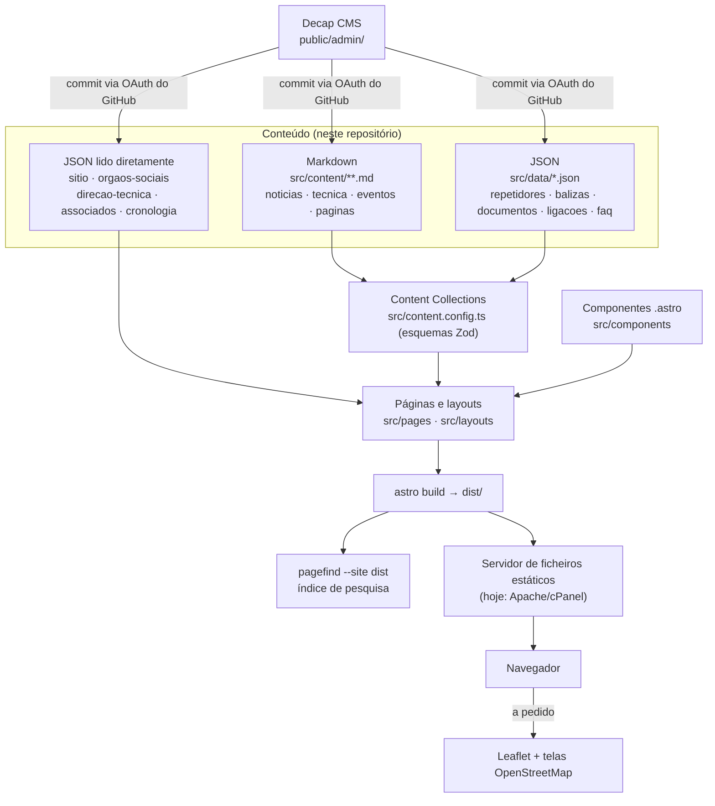

# ARLA — Sítio Web

Sítio oficial da **ARLA — Associação de Radioamadores do Litoral Alentejano**, associação
sem fins lucrativos sediada em Santiago do Cacém, com o indicativo coletivo **CS5ARLA**.

- **Sítio em produção:** [www.cs5arla.pt](https://www.cs5arla.pt)
- **Repositório:** [github.com/themantas1994/arla-site](https://github.com/themantas1994/arla-site)
- **Estado:** reconstrução completa do antigo sítio WordPress, com os conteúdos migrados. Em produção.

O sítio publica notícias e comunicados da associação, artigos técnicos de radioamadorismo,
eventos e — o que mais importa aos associados — os dados da rede de repetidores e balizas
da ARLA: frequências, tons, acessos e estado operacional. A direção edita tudo isto num
editor no navegador, sem escrever código; quem desenvolve trabalha com os mesmos conteúdos
sob a forma de ficheiros Markdown e JSON neste repositório.

Este README é o ponto de entrada rápido. A documentação técnica aprofundada está na
[Wiki](wiki/Home.md); a documentação dirigida à direção da associação está em [`docs/`](docs/).
O resultado da última auditoria ao repositório está em
[`docs/auditoria-do-projeto.md`](docs/auditoria-do-projeto.md).

---

## Funcionalidades

Tudo o que se segue está **implementado e verificado** no código (ver
[auditoria](docs/auditoria-do-projeto.md)):

- **Notícias e comunicados** — 39 artigos migrados, com categorias, etiquetas, paginação e
  páginas por categoria.
- **Artigos técnicos** — 8 artigos sobre satélites, QO-100, micro-ondas e propagação, com
  nível de dificuldade, índice de conteúdos, referências e tempo de leitura.
- **Eventos** — 17 eventos e atividades, classificados automaticamente como programados, a
  decorrer ou terminados a partir da data do dia.
- **Diretório de repetidores e balizas** — 9 repetidores/digipeaters e 4 balizas, com
  pesquisa e filtros no lado do cliente, botões de cópia de frequências e vista em cartões
  no telemóvel.
- **Mapa da rede** — Leaflet + OpenStreetMap, carregado apenas quando entra no ecrã, com
  lista de localizações em texto como alternativa acessível e sem JavaScript.
- **Pesquisa em todo o sítio** — Pagefind, com o índice construído a partir do HTML final,
  depois do `astro build`.
- **Informação institucional** — órgãos sociais, direção técnica, lista de associados e
  cronologia, tudo em dados estruturados editáveis.
- **Biblioteca de documentos** — estatutos, regulamentos e ficha de inscrição em PDF.
- **Gestão de conteúdos em `/admin/`** (Decap CMS) — publicar não exige alterações ao código.
- **Tema claro e escuro** — escuro por predefinição, guardado em `localStorage`, respeitando
  `prefers-color-scheme` e `prefers-reduced-motion`.
- **Design responsivo** — navegação para telemóvel com submenus operáveis por teclado;
  tabelas de dados que passam a cartões em ecrãs estreitos.
- **Acessibilidade com objetivo WCAG 2.2 AA** — ver [Acessibilidade](wiki/Acessibilidade.md)
  para o que está implementado, o que foi medido e o que não foi testado.
- **SEO** — metadados por página, Open Graph e Twitter Card, dados estruturados JSON-LD,
  sitemap, feed RSS e redireções permanentes a partir dos endereços do sítio WordPress.
- **Páginas legais** — aviso legal, política de privacidade e política de cookies.

Não existe autenticação de utilizadores, sistema de comentários nem comportamento dinâmico
no servidor: o sítio é totalmente estático.

---

## Tecnologia

Versões lidas do `package.json` e do `package-lock.json` deste repositório:

| Tecnologia | Versão declarada | Para que serve |
| --- | --- | --- |
| [Astro](https://astro.build) | `^5.15.10` | Gerador do sítio; produz HTML estático no build e não envia JavaScript por predefinição |
| TypeScript | `^5.9.3` | Verificação de tipos (`astro/tsconfigs/strict`, com `strictNullChecks`) |
| Astro Content Collections + Zod | incluído no Astro | Conteúdo validado por esquema: dados inválidos fazem falhar o build |
| CSS nativo (`src/styles/global.css`) | — | Sistema de design em `@layer` e custom properties. Sem framework nem pré-processador |
| [Decap CMS](https://decapcms.org) | `^3.8.4` (via CDN em `public/admin/index.html`) | Editor de conteúdos ligado ao Git, autenticado por OAuth do GitHub |
| [Leaflet](https://leafletjs.com) | `^1.9.4` | Mapa da rede, com telas do OpenStreetMap |
| [Pagefind](https://pagefind.app) | `^1.4.0` | Índice de pesquisa estático, construído a partir do HTML gerado |
| [Sharp](https://sharp.pixelplumbing.com) | `^0.34.4` | Redimensionamento e recodificação das imagens migradas (`scripts/otimizar-media.mjs`) |
| [Playwright](https://playwright.dev) + [@axe-core/playwright](https://github.com/dequelabs/axe-core-npm) | `^1.63.0` / `^4.13.0` | Guiões de QA de acessibilidade, responsivo, funcional e desempenho |
| `@astrojs/sitemap`, `@astrojs/rss` | `^3.6.0` / `^4.0.12` | Sitemap e feed RSS |
| `@astrojs/check` | `^0.9.4` | Suporte ao `astro check` |

Não há backend, base de dados nem runtime no servidor em produção: `npm run build` produz
uma pasta de ficheiros estáticos que qualquer servidor Web serve.

---

## Arquitetura

Todas as páginas são geradas uma única vez, no build, a partir de Markdown e JSON guardados
neste repositório Git. Não há renderização por pedido nem base de dados.



**Modo de renderização.** O `output` não está definido em `astro.config.mjs`, pelo que o
Astro usa o modo estático: todas as rotas são pré-renderizadas. `trailingSlash: 'always'` e
`build.format: 'directory'` fazem com que cada rota seja servida como `.../index.html` e
todos os endereços terminem em `/`.

**Encaminhamento.** Baseado em ficheiros, sob `src/pages/` (41 ficheiros de rota: 40
`.astro` e um `rss.xml.ts`). As rotas de conteúdo usam `getStaticPaths()`. O build gera
**113 páginas HTML** e mais 183 páginas-stub de redireção. Ver [Rotas](wiki/Rotas.md).

**Fluxo de dados.** Quem edita (pelo CMS ou por commit direto) altera um ficheiro Markdown
ou JSON → o carregador de conteúdos (`src/content.config.ts`) valida-o contra um esquema
Zod no build → as páginas leem os dados validados através de `getCollection()` e dos
auxiliares em `src/lib/conteudo.ts` → os componentes apresentam-nos. Um campo obrigatório em
falta faz falhar `npm run build` com o ficheiro e o campo identificados, em vez de publicar
dados errados — o que não é um detalhe num sítio que publica frequências usadas para
sintonizar rádios.

**Componentes.** `src/components/` tem 19 componentes `.astro` reutilizáveis (todos em uso);
`src/layouts/` tem três invólucros de página: `Base.astro` (documento HTML, cabeçalho,
rodapé, metadados), `Pagina.astro` (páginas de texto) e `Artigo.astro` (notícias e artigos).

**Serviços externos.** Nenhum carrega por predefinição. Três exceções, todas diferidas:
telas do OpenStreetMap (só quando um mapa entra no ecrã), painéis do HamQSL/NOAA
(`loading="lazy"`, numa única página) e o próprio Decap CMS (`/admin/`, bloqueado no
`robots.txt`). O Leaflet é uma dependência do projeto, carregada por `import()` dinâmico —
não vem de um CDN.

Razões de cada decisão: [`docs/arquitetura.md`](docs/arquitetura.md) e
[Arquitetura](wiki/Arquitetura.md).

---

## Requisitos

- **Node.js ≥ 20.3** (`package.json` → `engines.node`). A versão usada em desenvolvimento
  está fixada em [`.nvmrc`](.nvmrc) (**22**) — com `nvm`, basta `nvm use`.
- **npm** (vem com o Node). Existe um único `package-lock.json`; não há outro gestor de
  pacotes configurado.

## Instalação

```bash
git clone https://github.com/themantas1994/arla-site.git
cd arla-site
npm install
```

Não é preciso definir variáveis de ambiente para instalar ou executar o projeto — ver
[Variáveis de ambiente](#variáveis-de-ambiente).

## Desenvolvimento

```bash
npm run dev
```

Inicia o servidor de desenvolvimento do Astro em **http://localhost:4321**, com recarga a
quente de componentes, estilos e conteúdos.

**A pesquisa não funciona em `npm run dev`.** O índice do Pagefind é construído a partir do
HTML final em `dist/`, pelo que só existe depois de `npm run build`. A página `/pesquisa/`
indica que o índice não está disponível — é o comportamento esperado, não uma avaria.

Ver [Desenvolvimento Local](wiki/Desenvolvimento-Local.md) para o ciclo completo
dev → build → preview e para usar o CMS localmente.

---

## Comandos disponíveis

| Comando | O que faz |
| --- | --- |
| `npm run dev` | Servidor de desenvolvimento com recarga a quente (`astro dev`) |
| `npm start` | Igual a `npm run dev` |
| `npm run build` | Valida os dados, gera o sítio em `dist/` e a seguir o índice de pesquisa |
| `npm run preview` | Serve o conteúdo de `dist/` localmente, como em produção |
| `npm run check` | `astro check` — verificação de tipos em todo o projeto |
| `npm test` | Testes unitários da lógica pura de `src/lib/` (Vitest). `npm run test:watch` para o modo contínuo |
| `npm run validar` | Tudo o que não precisa de navegador: tipos, redireções, esquemas, dados, documentos e testes |
| `npm run lint:links` | Ligações partidas e âncoras no `dist/` gerado (acrescente `-- --externas` para também testar ligações externas) |
| `npm run redirecoes:gerar` | Reescreve `public/.htaccess` e `public/_redirects` a partir de `src/lib/redirects.mjs` |
| `npm run redirecoes:validar` | Concordância das 191 regras nos três ficheiros; ciclos, cadeias e duplicados |
| `npm run validar:dados` | Esquemas Zod dos 5 ficheiros JSON fora das coleções (corre dentro do `build`) |
| `npm run validar:esquemas` | Concordância entre `public/admin/config.yml` e `src/content.config.ts` |
| `npm run validar:documentos` | Cada PDF da biblioteca existe e o tamanho publicado está certo |
| `npm run qa` | Acessibilidade (axe-core), transbordo responsivo em 7 larguras e testes funcionais num Chromium real |
| `npm run qa:capturas` | Capturas de ecrã responsivas para `reports/capturas/` (`scripts/capturas.mjs`) |
| `npm run audit:seo` | Metadados, dados estruturados, hierarquia de títulos e sitemap, sobre o `dist/` |
| `npm run audit:desempenho` | Core Web Vitals (LCP, FCP, CLS) sob 4G lento, num navegador real |
| `npm run audit:csp` | Aplica a Content-Security-Policy em modo impositivo e conta o que ficaria bloqueado |
| `npm run media:otimizar` | Redimensiona imagens migradas para 1600 px de largura máxima (reescreve ficheiros) |
| `npm run conteudo:resumos` | Regenera o campo `resumo` a partir do texto. Pré-visualiza; `-- --escrever` para gravar |

Os dois últimos **reescrevem ficheiros do repositório** e não correm no build nem em
produção: são utilitários de manutenção, para executar à mão e rever no diff.

`npm run qa`, `audit:seo`, `audit:desempenho` e `audit:csp` precisam de um build servido
localmente:

```bash
npm run build
npm run preview &
npm run qa
npm run audit:seo
npm run audit:desempenho
npm run audit:csp
```

Os relatórios são escritos em `reports/` (ignorado pelo Git, por ser regenerável). Os
resultados registados estão em [`docs/qualidade.md`](docs/qualidade.md).

---

## Estrutura do projeto

```text
src/
  content/                   Conteúdo editorial em Markdown (validado por src/content.config.ts)
    noticias/                39 notícias e comunicados
    tecnica/                 8 artigos técnicos
    eventos/                 17 eventos e atividades
    paginas/                 4 páginas de texto longo
  data/                      Dados estruturados em JSON, editáveis pelo CMS
    sitio.json               Morada, contactos, IBAN, quota, redes sociais
    repetidores.json         Um registo por repetidor (9)
    balizas.json             Um registo por baliza (4)
    orgaos-sociais.json      Mesa da AG, direção e conselho fiscal
    direcao-tecnica.json     Equipa técnica, por área
    associados.json          Lista pública de associados
    cronologia.json          História da associação, entrada a entrada
    documentos.json          Metadados da biblioteca de documentos
    ligacoes.json            Ligações externas selecionadas
    faq.json                 Perguntas frequentes
  components/                19 componentes .astro reutilizáveis
  layouts/                   Base.astro, Pagina.astro, Artigo.astro
  lib/                       Auxiliares: conteúdo, Maidenhead, navegação, rede, redireções, formatação
  styles/global.css          O sistema de design completo (507 linhas), num único ficheiro
  content.config.ts          Definição das 9 coleções e respetivos esquemas Zod
public/
  admin/                     Decap CMS (config.yml + index.html)
  documentos/                PDF da associação (estatutos, regulamentos, ficha de inscrição)
  imagens/                   Logótipos, ícones e, em conteudo/, a media migrada
  .htaccess                  Redireções 301, cabeçalhos de segurança e de cache (Apache)
  _redirects                 Redireções 301 no formato Netlify/Cloudflare Pages
  robots.txt, manifest.webmanifest, favicons
docs/                        Documentação em português para a direção e para quem mantém o projeto
scripts/                     QA, auditorias de SEO e desempenho, verificação de ligações, otimização de media
wiki/                        Wiki técnica para quem desenvolve (português)
```

Detalhe ficheiro a ficheiro: [Estrutura do Projeto](wiki/Estrutura-do-Projeto.md).

---

## Gestão de conteúdos

Todo o conteúdo vive neste repositório como ficheiros de texto — Markdown para prosa, JSON
para registos estruturados — validado contra esquemas Zod em `src/content.config.ts`. Nada
de editorial está escrito no código.

| Tipo de conteúdo | Formato | Localização | Coleção |
| --- | --- | --- | --- |
| Notícias | Markdown + frontmatter | `src/content/noticias/*.md` | `noticias` |
| Artigos técnicos | Markdown + frontmatter | `src/content/tecnica/*.md` | `tecnica` |
| Eventos | Markdown + frontmatter | `src/content/eventos/*.md` | `eventos` |
| Páginas de texto | Markdown + frontmatter | `src/content/paginas/*.md` | `paginas` |
| Repetidores | JSON | `src/data/repetidores.json` | `repetidores` |
| Balizas | JSON | `src/data/balizas.json` | `balizas` |
| Documentos | JSON | `src/data/documentos.json` | `documentos` |
| Ligações úteis | JSON | `src/data/ligacoes.json` | `ligacoes` |
| Perguntas frequentes | JSON | `src/data/faq.json` | `faq` |
| Dados gerais, órgãos sociais, direção técnica, associados, cronologia | JSON | `src/data/sitio.json`, `orgaos-sociais.json`, `direcao-tecnica.json`, `associados.json`, `cronologia.json` | *(lidos por importação direta, não são coleções)* |

Os ficheiros JSON guardam a lista dentro de uma chave (`{ "repetidores": [...] }`) em vez de
terem um array na raiz: o Decap CMS não consegue editar um JSON cuja raiz seja um array, e o
`content.config.ts` desembrulha-a com um pequeno parser (`listaEm()`).

Há duas formas de editar:

1. **Em `/admin/`** (Decap CMS) — formulários para quem não programa; cada gravação é um
   commit. Guia da associação: [`docs/gestao-de-conteudos.md`](docs/gestao-de-conteudos.md).
2. **Diretamente em Git** — editar os ficheiros e fazer commit. O `npm run build` falha com
   o ficheiro e o campo identificados se faltar algo obrigatório.

Referência para quem desenvolve: [Coleções de Conteúdo](wiki/Colecoes-de-Conteudo.md) e
[Gestão de Conteúdos](wiki/Gestao-de-Conteudos.md).

---

## Sistema de repetidores

Definido pela coleção `repetidores` (`src/data/repetidores.json`, esquema em
`src/content.config.ts`) e apresentado por `src/components/TabelaRepetidores.astro`.

**Modelo de dados** (por repetidor, tal como o esquema Zod o define):

```ts
{
  id: string;                  // identificador único, ex.: "cq0vstc"
  canal?: string;              // ex.: "RV56"
  banda: 'VHF' | 'UHF' | 'SHF' | 'HF';
  modo: string;                // texto livre, ex.: "Analógico", "Digital DMR"
  filtros: string[];           // ex.: ["vhf", "analogico"] — governa os botões de filtro
  localizacao: string;
  quadricula?: string;         // quadrícula Maidenhead, ex.: "IM57px"
  coordenadas?: { lat: number; lon: number };  // coordenadas exatas, se conhecidas
  frequenciaTx: string;
  frequenciaRx: string;
  tom?: string;
  acesso?: string;             // tom CTCSS, talkgroup e color code DMR, ou reflector
  potencia?: string;
  indicativo: string;
  estado: 'operacional' | 'manutencao' | 'indisponivel' | 'desconhecido';
  notas?: string;
}
```

As balizas (`balizas.json`) seguem o mesmo padrão, com um conjunto de campos ligeiramente
diferente: têm `frequencia` (uma só) e `antena`, e não têm `canal`, `acesso` nem `filtros`.

**Apresentação.** `TabelaRepetidores.astro` gera duas vistas sincronizadas a partir dos
mesmos dados: uma `<table>` para ecrãs com 860px ou mais e uma lista de cartões (`<ul>`)
abaixo disso, alternadas apenas por media queries CSS — sem duplicação de lógica e sem
JavaScript a decidir o layout.

**Pesquisa e filtros** correm inteiramente no cliente (um `<script>` no próprio componente,
sem framework): a pesquisa compara com uma cadeia pré-calculada e sem acentos por linha (por
isso «Arrabida» encontra «Arrábida»), e as caixas de verificação estão divididas em dois
grupos — *banda* (`vhf`, `uhf`) e *modo* (`analogico`, `dmr`, `dstar`, `aprs`). Dentro de
cada grupo a relação é «ou»; entre grupos é «e». Quando nada corresponde, aparece o estado
vazio (`EstadoVazio.astro`).

**Estado.** O campo `estado` alimenta `DistintivoEstado.astro`, usado na tabela, nos cartões,
na página inicial e no resumo da rede — a mesma fonte em todo o lado. O distintivo nunca
depende só da cor: tem sempre símbolo (`●` `◐` `✕` `?`) e texto.

**Posição no mapa.** Vem de `quadricula` (locator Maidenhead) convertida para o centro da
quadrícula por `src/lib/maidenhead.ts`, a não ser que `coordenadas` esteja preenchido, caso
em que este tem prioridade. Quando a posição vem da quadrícula, tanto a nota sob o mapa como
o popup do marcador o dizem. **Hoje nenhum repetidor ou baliza tem `coordenadas`**: todas as
posições da rede são aproximadas, e o sítio declara-o.

**Acrescentar um repetidor:** em `/admin/` → **Rede ARLA → Repetidores → Add Repetidor**, ou
acrescentando um objeto ao array `repetidores` em `src/data/repetidores.json`. Atenção a
dois campos: `id` tem de ser único, e um repetidor sem as entradas certas em `filtros`
aparece na tabela mas desaparece assim que alguém filtrar.

**Editar ou mudar o estado:** alterar os campos (normalmente `estado` e `notas`) pelo CMS ou
no JSON — a mudança propaga-se a todas as páginas que leem a coleção.

**Remover ou arquivar:** não existe marcação de «arquivado» para repetidores. Um repetidor
desativado é removido do array, ou fica com `estado: indisponivel` e uma nota, se a
associação quiser manter o registo publicado.

**Validação:** feita pelo esquema Zod no build. O `npm run build` falha se faltar um campo
obrigatório (`id`, `banda`, `modo`, `localizacao`, `frequenciaTx`, `frequenciaRx`,
`indicativo`, `estado`) ou se um valor de enum (`banda`, `estado`) não for um dos permitidos.

Referência campo a campo: [Sistema de Repetidores](wiki/Sistema-de-Repetidores.md) e
[Balizas e Rede](wiki/Balizas-e-Rede.md).

---

## Notícias e artigos

**Fonte:** ficheiros Markdown com frontmatter YAML, um por artigo, em
`src/content/noticias/` e `src/content/tecnica/`. Ambos estendem o esquema comum
(`baseArtigo` em `src/content.config.ts`).

**Campos comuns:** `titulo`, `resumo`, `data`, `atualizado?`, `autor?`, `indicativo?`,
`imagem?`, `imagemAlt?`, `categoria` (predefinição `'Geral'`), `etiquetas` (array),
`historico` (booleano — marca conteúdo datado e mostra um aviso de contexto),
`notaHistorica?`, `urlAntigo?` (endereço no WordPress, para o mapa de redireções),
`destaque`, `rascunho` e `anexos`.

**Os artigos técnicos acrescentam:** `indice` (mostrar índice, predefinição `true`), `nivel`
(`introducao` | `intermedio` | `avancado`) e `referencias` (array de `{ titulo, url }`).

**Rotas:** `src/pages/noticias/[...slug].astro` e `src/pages/tecnica/[...slug].astro` geram
uma página por entrada com `getStaticPaths()`. **O slug é o nome do ficheiro** sem `.md` —
`src/content/noticias/5-ciclo-raid.md` → `/noticias/5-ciclo-raid/`.

**Imagens:** referenciadas por caminho absoluto em `imagem` (ex.:
`/imagens/conteudo/ct1fbf.jpg`), servidas a partir de `public/imagens/conteudo/`. O
`imagemAlt` é a descrição acessível; o CMS indica que é obrigatório sempre que houver imagem.

**Datas:** `data` determina a ordenação (`src/lib/conteudo.ts` ordena por data decrescente),
o feed RSS e o `datePublished` do JSON-LD.

**Categorias e etiquetas:** `categoria` é texto livre (com lista de sugestões no CMS) e
`etiquetas` é um array. `src/pages/noticias/categoria/[categoria].astro` gera uma página de
listagem por categoria.

**Conteúdo relacionado:** `relacionados()` em `src/lib/conteudo.ts` pontua as outras entradas
por etiquetas partilhadas (×2) e categoria igual (×1), completando com as mais recentes se
faltarem.

**Arquivo:** nada é arquivado automaticamente. O conteúdo datado é marcado com
`historico: true` e uma `notaHistorica` opcional — o artigo continua publicado e pesquisável,
mas mostra um aviso de contexto.

**Publicar uma notícia, passo a passo:**

1. Criar `src/content/noticias/nome-do-artigo.md` (o nome do ficheiro passa a ser o slug).
2. Escrever o frontmatter, com pelo menos `titulo`, `resumo` e `data`:

   ```markdown
   ---
   titulo: "Título da notícia"
   resumo: "Uma ou duas frases — usadas nos cartões, na pesquisa e nas redes sociais."
   data: "2026-09-20"
   categoria: "Associação"
   etiquetas: []
   historico: false
   destaque: false
   ---

   Corpo do artigo em Markdown.
   ```

3. Correr `npm run build` (ou `npm run check`) — se faltar um campo obrigatório, o build
   falha a indicar o ficheiro e o campo.
4. Em alternativa, `/admin/` → **Notícias → New Notícia**, que produz exatamente o mesmo
   ficheiro.

Mais detalhe: [Notícias e Artigos](wiki/Noticias-e-Artigos.md).

---

## Eventos

**Fonte:** ficheiros Markdown em `src/content/eventos/`; o esquema estende `baseArtigo`.

**Campos próprios:** `inicio` (obrigatório), `fim?`, `dataTexto?` (texto livre que substitui
a data formatada quando esta é aproximada), `horaInicio?`, `horaFim?`, `local?`,
`coordenadas?` (`{ lat, lon }` — sem isto não é mostrado mapa), `organizador?`, `inscricoes?`,
`ligacaoExterna?`, `tipo` (`atividade` | `workshop` | `concurso` | `encontro` | `divulgacao`,
predefinição `atividade`) e `cancelado` (booleano).

**Datas e estado:** `estadoEvento(inicio, fim)` em `src/lib/sitio.ts` compara dias completos
em UTC com o dia de hoje e devolve `'futuro'`, `'adecorrer'` ou `'terminado'` — apresentados
como «Brevemente», «A decorrer» e «Terminado». `eventosFuturos()` e `eventosPassados()` em
`src/lib/conteudo.ts` filtram e ordenam em conformidade. Não há nada para mover à mão entre
listas.

**Páginas:** `src/pages/eventos/[...slug].astro` gera uma página por entrada (slug = nome do
ficheiro), com o corpo Markdown e os campos estruturados.

**Ligações externas:** `ligacaoExterna` para uma página externa relacionada (use
`tipo: divulgacao` para eventos de terceiros que a ARLA apenas divulga) e `organizador` para
creditar quem organiza.

**Inscrições:** `inscricoes` é texto livre — **não existe formulário nem backend de
inscrições**. Serve para instruções ou para uma ligação de contacto.

**Acrescentar:** criar `src/content/eventos/nome-do-evento.md` com pelo menos `titulo`,
`resumo` e `inicio`, ou usar `/admin/` → **Eventos e atividades → New Evento**. Um evento
passado nunca deve ser apagado — o arquivo faz parte da história da associação; um evento
cancelado marca-se com `cancelado: true`.

Mais detalhe: [Eventos](wiki/Eventos.md).

---

## Media e imagens

- **Onde está:** `public/imagens/conteudo/` (imagens e dois vídeos migrados),
  `public/documentos/` (PDF da associação) e `public/imagens/` (logótipos e ícones). Os
  carregamentos feitos pelo CMS vão para `public/imagens/conteudo/` (`media_folder` em
  `public/admin/config.yml`).
- **Formatos:** `.jpg`/`.jpeg` e `.png` para imagens, `.mp4` para os vídeos migrados, `.pdf`
  para documentos.
- **Otimização:** `scripts/otimizar-media.mjs` usa o Sharp para redimensionar a 1600px de
  largura máxima e recodificar (mozjpeg para JPEG, PNG paletizado para PNG), ignorando o que
  já é pequeno. É idempotente e **não faz parte do build**: corre-se à mão sobre um lote de
  media. **Não há otimização automática de imagens durante `npm run build`** — as definições
  `image` em `astro.config.mjs` (`layout: 'constrained'`, `responsiveStyles: true`) só se
  aplicam às APIs `<Image>`/`getImage()` do Astro, e as páginas atuais referenciam as imagens
  com ``.
- **Nomes:** os ficheiros migrados mantêm o nome original (ex.: `20180818_Torre_ARLA-1.jpg`);
  os carregamentos pelo CMS mantêm o nome do ficheiro enviado. **Evite nomes que só difiram
  em maiúsculas:** o repositório tinha `hamRadio.mp4` e `hamradio.mp4`, byte a byte iguais,
  que em macOS e Windows se sobrepõem um ao outro. Ficou só `hamradio.mp4`, com uma
  redireção 301 do nome antigo (auditoria: DT-010).
- **Referenciar:** por caminho absoluto a partir de `public/`, ex.:
  `/imagens/conteudo/ct1fbf.jpg`.
- **Texto alternativo:** `imagemAlt` no frontmatter. Imagens decorativas devem ficar com
  texto alternativo vazio.

Mais detalhe: [Media e Imagens](wiki/Media-e-Imagens.md).

---

## Estilos

Não há framework de CSS (nem Tailwind, nem CSS Modules, nem Sass): o sistema de design é um
único ficheiro, [`src/styles/global.css`](src/styles/global.css) (507 linhas), importado uma
vez a partir de `Base.astro`, com `@layer` nativo para uma cascata previsível e custom
properties para todos os tokens.

A ordem das camadas é `@layer reset, tokens, base, components, utilities;`.

| Grupo de tokens | Exemplos |
| --- | --- |
| Cor de marca | `--arla-500: #0082c8`, mais `--arla-200/300/400/600/700/900` |
| Cores de estado | `--sinal` (operacional), `--alerta` (manutenção), `--falha` (indisponível) |
| Espaçamento | `--e-1` (0.25rem) a `--e-7` (3rem); `--e-8` e `--e-9` fluidos com `clamp()` |
| Tipografia | `--t-xs` a `--t-4xl`, vários com `clamp()` |
| Tipos de letra | `--fonte-base` (pilha do sistema — nenhum tipo de letra descarregado), `--fonte-mono` |
| Raios | `--raio-sm` (6px), `--raio` (12px), `--raio-lg` (18px), `--raio-xl` (26px) |
| Layout | `--largura` (1200px), `--largura-texto` (72ch) |
| Movimento | `--transicao` (160ms) |

**Temas.** O escuro é a predefinição (valores em `:root`), com um tema claro completo e
afinado à parte — não uma inversão — aplicado por `[data-tema='claro']` ou por
`prefers-color-scheme: light`. O tema ativo é escrito em `data-tema` no `<html>` por um
script em linha em `Base.astro`, antes da primeira pintura, e guardado em `localStorage` por
`AlternarTema.astro`. Todos os acessos ao `localStorage` estão dentro de `try`/`catch`: em
janela privada ou com armazenamento bloqueado, o sítio funciona à mesma com a preferência do
sistema.

**UI nova:** manter o padrão existente — blocos `<style>` com âmbito dentro de cada
componente `.astro`, referindo as custom properties partilhadas (`var(--accent)`,
`var(--e-4)`…) em vez de valores fixos.

Referência completa: [Sistema de Design](wiki/Sistema-de-Design.md).

---

## Design responsivo

**Não há uma escala única de breakpoints.** O `global.css` tem um só breakpoint de largura
(`640px`, para o espaçamento interior do contentor); os restantes são definidos em cada
componente ou página, conforme o conteúdo:

| Breakpoint | Onde | O que muda |
| --- | --- | --- |
| `640px` | `global.css`, `Rodape.astro`, `Artigo.astro` | Espaçamento interior e layout do rodapé |
| `700px` | `arla/quem-somos.astro` | Tabela de associados passa a cartões |
| `860px` | `TabelaRepetidores.astro` | Tabela de repetidores passa a cartões |
| `900px` | `rede/balizas.astro` | Tabela de balizas passa a cartões |
| `1100px` | `IndiceConteudos.astro`, `Artigo.astro` | Índice lateral dos artigos |
| `1180px` | `Cabecalho.astro` | Navegação de topo ↔ menu para telemóvel |
| `1400px` | `Cabecalho.astro`, `Logotipo.astro` | Ajustes do cabeçalho largo |

Outras páginas usam breakpoints próprios (560, 620, 720, 760, 800, 880, 960, 1000, 1080px)
para grelhas locais.

- **Navegação em ecrãs pequenos:** abaixo de 1180px, o menu abre por botão; os submenus
  abrem por clique **e** por teclado (não só por hover), fecham com `Escape` e mantêm
  `aria-expanded` correto.
- **Tabelas:** três tabelas de dados (repetidores, balizas, associados) têm vista em
  cartões, cada uma com o seu breakpoint, através das classes locais `.so-largo` /
  `.so-estreito`. **Estas classes não são globais** — estão definidas em cada um desses três
  ficheiros. A página `/arquivo/` não usa tabela.
- **Impressão:** o `@media print` de `global.css` esconde cabeçalho, rodapé, filtros,
  paginação e tudo o que tenha `.nao-imprimir`, e força a vista de tabela nos três casos
  acima, para que uma lista de repetidores impressa continue a ser uma tabela.

Mais detalhe: [Design Responsivo](wiki/Design-Responsivo.md).

---

## Acessibilidade

Objetivo: **WCAG 2.2 AA**. O que está implementado e verificado estruturalmente (resultados
medidos em [`docs/qualidade.md`](docs/qualidade.md)):

- Landmarks semânticos (`header`, `nav`, `main`, `article`, `section`, `aside`, `footer`) e
  hierarquia de títulos verificada página a página.
- Nada depende de passar o rato: os submenus abrem com clique e com teclado e fecham com
  `Escape`.
- Foco sempre visível (`:focus-visible`, contorno de 3px) e ligação «saltar para o conteúdo»
  como primeiro elemento focável.
- Tabelas com `<caption>`, `<thead>` e `scope` nas colunas, com vista em cartões em ecrãs
  estreitos em vez de uma tabela espremida.
- **O estado nunca é só cor:** operacional, manutenção, indisponível e por confirmar têm
  símbolo (`●` `◐` `✕` `?`) e texto, legíveis em impressão a preto e branco.
- Alvos de toque de pelo menos 44 × 44 px nos controlos principais.
- Região `aria-live` (`#anuncio-acessibilidade`, em `Base.astro`) que anuncia a cópia de uma
  frequência.
- Todos os mapas têm a mesma informação em texto (`<details>` em `Mapa.astro`), para uso sem
  JavaScript e sem visão.
- `prefers-reduced-motion` desliga a animação do herói, a pulsação dos indicadores e as
  transições.

**Limite desta medição, dito sem rodeios:** os testes automáticos com axe-core verificam
estrutura DOM e ARIA, não usabilidade real. **Não foram testados** leitores de ecrã reais
(NVDA, VoiceOver), navegação exclusivamente por teclado por um utilizador habitual, nem
compreensão do texto por pessoas com dificuldades de leitura. Um resultado de 0 violações no
axe-core **não é prova de conformidade WCAG**.

Mais detalhe: [Acessibilidade](wiki/Acessibilidade.md).

---

## SEO

- Endereços semânticos em português, sem datas no caminho.
- Todas as páginas definem `<title>`, descrição, canónico, Open Graph e Twitter Card,
  construídos em `Base.astro` a partir das props de cada página.
- Dados estruturados JSON-LD: `Organization` em todo o sítio (em `Base.astro`) e
  `BreadcrumbList` em todas as páginas com migalhas (`MigalhasPao.astro`), mais
  `NewsArticle`, `TechArticle`, `Event`, `FAQPage`, `HowTo`, `ContactPage` e `WebSite` (este
  com `SearchAction` para `/pesquisa/`) conforme o tipo de página.
- `sitemap-index.xml` gerado no build por `@astrojs/sitemap`, excluindo `/area-reservada/`
  (ver o `filter` em `astro.config.mjs`). A última execução produziu 109 endereços.
- `robots.txt` bloqueia `/admin/` e `/area-reservada/` e aponta para o sitemap.
- Feed RSS em `/rss.xml` (`src/pages/rss.xml.ts`, com `@astrojs/rss`), juntando notícias,
  artigos técnicos e eventos.
- Redireções permanentes a partir do sítio WordPress — ver abaixo.

Referência das props e dos padrões por tipo de página: [SEO](wiki/SEO.md).

### Redireções

**`src/lib/redirects.mjs` é a fonte única.** Os dois ficheiros de servidor são gerados a
partir dele por `npm run redirecoes:gerar` e **não devem ser editados à mão**:

```text
src/lib/redirects.mjs
  ├─ redirects (183)              → astro.config.mjs: páginas com meta refresh,
  │                                 que funcionam em qualquer alojamento
  ├─ redirecoesDeFicheiros (7)    ┐  só ao nível do servidor: uma página HTML
  └─ capturaFinal (1)             ┘  num caminho .pdf partiria o descarregamento
              │
              │  npm run redirecoes:gerar
              ▼
   public/.htaccess (191)      public/_redirects (191)
```

| Onde | Quantas | O quê |
| --- | --- | --- |
| `src/lib/redirects.mjs` | **191** no total | 183 de rota + 7 de ficheiro estático + 1 de recolha final |
| `public/.htaccess` | **191** regras `R=301` | Geradas; só o bloco entre marcadores é reescrito — cabeçalhos de segurança, cache, CSP e `ErrorDocument` ficam intactos |
| `public/_redirects` | **191** linhas | Geradas; formato Netlify/Cloudflare Pages |

As 183 rotas correspondem a **93 endereços canónicos** (90 deles em duas variantes, com e
sem o prefixo `/site/`).

`npm run redirecoes:validar` falha se os ficheiros divergirem da fonte, ou se houver
origens duplicadas, ciclos, cadeias, destinos inexistentes ou caminhos mal formados. Corre
em integração contínua.

O mapa completo, endereço a endereço, está em
[`docs/mapa-de-redirecoes.md`](docs/mapa-de-redirecoes.md) e em
[Redirecionamentos](wiki/Redirecionamentos.md).

---

## Variáveis de ambiente

O sítio constrói e funciona com **zero variáveis obrigatórias**. Existem duas, ambas
opcionais:

| Variável | Descrição | Obrigatória | Segredo | Onde é utilizada |
| --- | --- | --- | --- | --- |
| `PUBLIC_SITE_URL` | Origem canónica usada em `<link rel="canonical">`, Open Graph, sitemap, RSS e `robots.txt`. Predefinição: `https://www.cs5arla.pt` | Não | Não | `astro.config.mjs` (`site`), `src/pages/robots.txt.ts` e `scripts/check-links.mjs` (para distinguir ligações próprias de externas) |
| `CHROMIUM_PATH` | Caminho para o binário do Chromium usado pelos guiões de navegador. Predefinição: `/opt/pw-browsers/chromium` | Não | Não | `scripts/qa.mjs`, `scripts/lib/capturas.mjs`, `scripts/auditar-desempenho.mjs`, `scripts/auditar-csp.mjs` |

```bash
PUBLIC_SITE_URL=https://ensaio.exemplo.pt npm run build
```

**Quando é preciso definir `CHROMIUM_PATH`.** Os quatro guiões acima tentam, por esta ordem:

1. o caminho em `CHROMIUM_PATH`, se a variável estiver definida;
2. `/opt/pw-browsers/chromium`, se existir — é onde alguns ambientes de contentor já trazem
   o Chromium instalado, para não ser preciso descarregar outro;
3. o navegador que o Playwright instala, se nenhum dos anteriores existir.

Ou seja: **numa máquina normal não é preciso definir nada.** Basta ter corrido
`npx playwright install chromium` uma vez e o passo 3 trata do resto — é também o que
acontece na integração contínua. Defina `CHROMIUM_PATH` apenas se quiser usar um Chromium
que já tem instalado noutro sítio:

```bash
CHROMIUM_PATH=/usr/bin/chromium npm run qa
```

O caminho é específico de cada máquina. Não o escreva em nenhum ficheiro do repositório.

**Não há segredos neste repositório** — nenhuma chave de API, credencial ou token. O Decap
CMS autentica quem edita por OAuth do GitHub, configurado fora do repositório, pelo que o
sítio nunca vê nem guarda palavras-passe. `.env`, `.env.production` e `.env.local` estão no
`.gitignore` por precaução, embora nenhum exista.

Mais detalhe: [Variáveis de Ambiente](wiki/Variaveis-de-Ambiente.md).

---

## Build

```bash
npm ci
npm run build      # astro build, seguido de pagefind --site dist
```

As duas metades contam: o `astro build` gera o HTML/CSS/JS e o `pagefind --site dist`
percorre esse HTML para criar o índice em `dist/pagefind/`. Publicar só a saída do
`astro build` deixa a pesquisa vazia, sem qualquer erro visível.

O build de referência desta auditoria produziu **296 ficheiros HTML** em `dist/` (113
páginas reais e 183 páginas-stub de redireção), com o índice do Pagefind a cobrir 108
páginas.

---

## Implantação

O resultado do build é uma pasta de ficheiros estáticos; não é preciso runtime no servidor.

### Implantação atual — IMPLEMENTADO

**Apache com cPanel**, o mesmo ambiente onde o WordPress corria. O processo é manual:
`npm run build` e envio de **todo o conteúdo de `dist/`** para a raiz pública, incluindo o
ficheiro oculto `.htaccess` (que traz as redireções 301 e os cabeçalhos de segurança; muitos
clientes de FTP escondem-no por predefinição). São precisos o `mod_rewrite` e o `mod_headers`.

### Alternativas suportadas — NÃO UTILIZADAS HOJE

- **Netlify / Cloudflare Pages** — comando `npm run build`, pasta `dist`; o
  `public/_redirects` é reconhecido automaticamente.
- **Vercel** — mesmo comando e mesma pasta, mas o `_redirects` **não** é lido: seriam
  precisos um `vercel.json` traduzido a partir de `src/lib/redirects.mjs`, ou aceitar as
  páginas-stub do Astro (que funcionam, mas usam `meta refresh` em vez de 301 reais).
- **GitHub Pages** — funciona, sem redireções ao nível do servidor: as 191 regras 301
  passariam a depender das páginas-stub do Astro, o que é pior para uma década de ligações
  acumuladas.

### Automatização — NÃO IMPLEMENTADO

**Não existe atualmente um pipeline CI/CD automatizado neste repositório.**
[`docs/implantacao.md`](docs/implantacao.md) documenta uma *proposta* de workflow do GitHub
Actions; ver a secção seguinte.

### Editor de conteúdos

O Decap CMS precisa de uma aplicação OAuth do GitHub e de um serviço que troque o código de
autorização por um token (Git Gateway da Netlify, ou um serviço de OAuth próprio) — ver
[`docs/implantacao.md`](docs/implantacao.md#configurar-o-editor-de-conteúdos) e
[CMS Decap](wiki/CMS-Decap.md). **Esta configuração ainda não foi feita**, pelo que o
`/admin/` em produção não está funcional enquanto não existirem a aplicação OAuth e o
serviço de autenticação.

Mais detalhe: [Implantação](wiki/Implantacao.md).

---

## CI/CD

**Integração contínua: IMPLEMENTADA. Publicação automática: NÃO IMPLEMENTADA.**

`.github/workflows/qualidade.yml` corre a cada *push* e *pull request*, em dois trabalhos:

| Trabalho | O que corre |
| --- | --- |
| `verificar` | `npm audit` (informativo), `validar:dados`, `validar:esquemas`, `redirecoes:validar`, `validar:documentos`, `npm test`, `check`, `build`, `lint:links`, `audit:seo` |
| `navegador` | instala o Chromium do Playwright, serve o build e corre `qa`, `audit:csp` e `audit:desempenho`; guarda `reports/` como artefacto |

**O workflow não publica nada, de propósito.** Não tem nenhum passo de implantação e não
usa nenhum segredo. Publicar exigiria credenciais do alojamento e uma decisão sobre quem
controla a publicação, que ainda não foi tomada — ver
[`docs/decisoes-pendentes.md`](docs/decisoes-pendentes.md).

Continua a ser preciso alguém correr `npm run build` e enviar `dist/` para o alojamento.
Uma alteração gravada no CMS **não chega ao sítio** enquanto isso não acontecer.

Ver [CI/CD](wiki/CI-CD.md) e
[`docs/implantacao.md`](docs/implantacao.md#publicação-automática--não-implementada).

---

## Testes

A verificação é feita por estas ferramentas, todas presentes no repositório:

| Ferramenta | Objetivo | Comando | O que verifica |
| --- | --- | --- | --- |
| `astro check` (`@astrojs/check` + TypeScript) | Tipos | `npm run check` | Erros de tipo em `.astro` e `.ts` |
| **Vitest** | Lógica pura | `npm test` | 58 testes sobre `estadoEvento()`, `quadriculaParaCoordenadas()`, `formatarCoordenadas()`, `relacionados()`, `intervaloDatas()`, `slugCategoria()`, `tempoLeitura()`, `normalizar()` e `textoSimples()`, com casos normais e limite |
| `scripts/validar-dados.mjs` | Dados | `npm run validar:dados` | Esquemas Zod `strict` dos 5 JSON fora das coleções; corre dentro do `build` |
| `scripts/validar-esquemas.mjs` | CMS ↔ conteúdo | `npm run validar:esquemas` | Campos, obrigatoriedade e valores de `select` do Decap contra `src/content.config.ts` |
| `scripts/validar-redirecoes.mjs` | Redireções | `npm run redirecoes:validar` | 191 regras coerentes nos três ficheiros; ciclos, cadeias, duplicados, destinos inexistentes |
| `scripts/validar-documentos.mjs` | Documentos | `npm run validar:documentos` | Cada PDF existe e o tamanho publicado corresponde |
| `scripts/auditar-csp.mjs` | Segurança | `npm run audit:csp` | Aplica a CSP em modo impositivo em 15 páginas e conta violações |
| `scripts/qa.mjs` (Playwright + `@axe-core/playwright`) | Acessibilidade, responsivo e funcional | `npm run qa` | axe-core (`wcag2a`, `wcag2aa`, `wcag21a`, `wcag21aa`, `wcag22aa`, `best-practice`) em 37 páginas × 2 temas; transbordo horizontal em 7 larguras; 17 testes funcionais; alvos de toque; erros de consola |
| `scripts/capturas.mjs` | Revisão visual | `npm run qa:capturas` | Gera capturas responsivas em `reports/capturas/` |
| `scripts/check-links.mjs` | Ligações | `npm run lint:links` | Ligações internas, âncoras e (com `-- --externas`) ligações externas, sobre o `dist/` |
| `scripts/auditar-seo.mjs` | SEO | `npm run audit:seo` | Metadados, JSON-LD, hierarquia de títulos, sitemap e textos alternativos |
| `scripts/auditar-desempenho.mjs` | Desempenho | `npm run audit:desempenho` | LCP, FCP, CLS, peso e número de pedidos sob 4G lento e CPU 4× mais lento |

**Antes de submeter uma alteração**, no mínimo:

```bash
npm run validar          # tipos, redireções, esquemas, dados, documentos e testes
npm run build
npm run preview &
npm run lint:links
npm run qa
```

Tudo isto corre também em integração contínua (ver [CI/CD](#cicd)), mas correr localmente
poupa uma volta. Os resultados registados estão em
[`docs/qualidade.md`](docs/qualidade.md) e em [Testes e Qualidade](wiki/Testes-e-Qualidade.md).

---

## Segurança

O que está verificado:

- **Sem segredos no repositório** — nenhuma chave, credencial ou token.
- **Sem base de dados e sem código a correr no servidor** em produção: a superfície de
  ataque de um WordPress (plugins por atualizar, `wp-admin` exposto, injeção de SQL)
  desaparece.
- **Autenticação delegada ao GitHub** (OAuth) para edição de conteúdos; o sítio nunca vê nem
  guarda palavras-passe.
- **Cabeçalhos de segurança** em `public/.htaccess`: `X-Content-Type-Options`,
  `Referrer-Policy`, `X-Frame-Options`, `Permissions-Policy` e `Strict-Transport-Security`.
  Qualquer outro alojamento teria de os replicar ao nível do servidor ou da CDN.
- **Content-Security-Policy em modo `Report-Only`**, servida no `.htaccess` a partir da
  fonte única `scripts/lib/csp.mjs`. `npm run audit:csp` aplica-a em modo impositivo num
  navegador real e confirma que nenhuma das 15 páginas mais dependentes de recursos
  externos se parte. Ver [`docs/seguranca-csp.md`](docs/seguranca-csp.md).
- **Editor do CMS com versão fixa e Subresource Integrity.** `public/admin/index.html`
  carrega uma versão exata do Decap com `integrity` e `crossorigin`; um ficheiro trocado no
  CDN é recusado pelo navegador, verificado em teste.
- **Sem HTML de utilizador por sanear** — todo o conteúdo é Markdown escrito por quem tem
  acesso de escrita ao repositório e processado no build.
- Ligações externas com `rel="noopener noreferrer"`.
- `/admin/` e `/area-reservada/` bloqueados no `robots.txt` (não é uma fronteira de
  segurança, mas mantém-nos fora dos resultados de pesquisa).

Limitações conhecidas, ditas por inteiro:

- **A CSP está em `Report-Only`, não imposta.** Não bloqueia nada. E leva
  `'unsafe-inline'` em `script-src`, porque o Astro gera `<script type="module">` em linha
  e o guião do tema tem de correr antes da primeira pintura — ou seja, **não protege contra
  XSS injetado em linha**. O que falta para a impor está em
  [`docs/seguranca-csp.md`](docs/seguranca-csp.md).
- **Os cabeçalhos de segurança só existem no Apache.** Num alojamento que não leia
  `.htaccess`, nenhum deles é aplicado — CSP incluída.
- **O `npm audit` reporta 2 vulnerabilidades** (1 crítica no `astro`, 1 baixa no `esbuild`,
  esta só no servidor de desenvolvimento em Windows). Ambas exigem subir o Astro de 5 para
  7 — duas versões maiores —, o que é uma migração e não uma correção. A do `sharp` (alta)
  foi corrigida na remediação da auditoria, com `sharp@^0.35.4`. Análise de aplicabilidade
  em [`docs/auditoria-do-projeto.md`](docs/auditoria-do-projeto.md#segurança) e estado atual
  em [`docs/remediacao-da-auditoria.md`](docs/remediacao-da-auditoria.md).
- **O CMS em produção não está operacional** — falta o OAuth e a decisão sobre a branch
  publicada. Ver [`docs/decisoes-pendentes.md`](docs/decisoes-pendentes.md).

Mais detalhe: [Segurança](wiki/Seguranca.md).

---

## Resolução de problemas

**O `npm install` falha.** Confirme Node.js ≥ 20.3 (`node -v`); o projeto é desenvolvido
contra o Node 22 (`.nvmrc`). Apague `node_modules` e repita com `npm ci`.

**A pesquisa diz que o índice não está disponível em `npm run dev`.** É o esperado: o
Pagefind só indexa a saída de `npm run build`. Use `npm run build && npm run preview`.

**O `npm run build` falha com `[InvalidContentEntryDataError]`.** Um ficheiro de conteúdo
não tem um campo obrigatório, ou tem um valor inválido num campo de enum (`banda`, `estado`,
`tipo`, `nivel`). A mensagem indica a coleção, a entrada e o campo — é o esquema Zod a fazer
o seu trabalho.

**As imagens não aparecem depois de carregadas pelo CMS.** O Decap grava em
`public/imagens/conteudo/` e referencia como `/imagens/conteudo/…` (`media_folder` e
`public_folder` em `public/admin/config.yml`). Um ficheiro colocado à mão noutra pasta
precisa que o caminho seja ajustado.

**As redireções do sítio antigo não funcionam.** Estão definidas em `src/lib/redirects.mjs`
mas têm de ser publicadas no formato que o alojamento entende: o Apache lê o
`public/.htaccess`, a Netlify e a Cloudflare Pages leem o `public/_redirects`, os restantes
recorrem às páginas-stub geradas pelo Astro. Confirme que o `.htaccess` foi mesmo enviado.

**O `npm run check` acusa erros de tipo.** Corrija na origem: o projeto usa
`astro/tsconfigs/strict` com `strictNullChecks` e não tem supressões configuradas.

**Não há linter.** Não existe configuração de ESLint nem de Prettier; o `npm run check` é o
equivalente mais próximo.

Mais cenários: [Resolução de Problemas](wiki/Resolucao-de-Problemas.md).

---

## Contribuir

- **Branches:** não há convenção de nomes imposta no repositório. **Note que não existe uma
  branch `main`**: a branch predefinida é atualmente `claude/arla-website-redesign-vcemm3`.
  Parta da branch predefinida e abra o pull request contra ela. O
  `public/admin/config.yml` ainda aponta para `main` — ver
  [auditoria](docs/auditoria-do-projeto.md#problemas-encontrados) (DOC-020).
- **Mensagens de commit:** o histórico usa frases descritivas no imperativo, em português
  (ex.: `Redesenhar por completo o sítio da ARLA: Astro, CMS e migração de conteúdos`).
  Mantenha esse tom para alterações de conteúdo e de arquitetura.
- **Antes de abrir um pull request:** `npm run check`, `npm run build`, `npm run lint:links`
  e — para alterações de UI, de apresentação de conteúdo ou de acessibilidade — `npm run qa`.
  Não há CI que o faça por si.
- **Estilo de código:** siga o que já está no ficheiro que está a editar — blocos `<style>`
  com âmbito por componente, custom properties em vez de valores fixos, português nos textos
  visíveis e nos nomes dos campos do modelo de conteúdo (`titulo`, `resumo`, `estado`…).
- **Conteúdo** (artigos novos, atualizações de repetidores) pode ser alterado por `/admin/`
  ou por pull request.
- **Documentação:** atualize a página correspondente em `docs/` (para a direção) ou na
  [Wiki](wiki/Home.md) (para quem desenvolve) sempre que alterar a forma como o sítio é
  construído, publicado ou editado.

Mais detalhe: [Contribuir](wiki/Contribuir.md).

---

## Licença

**Não existe ficheiro `LICENSE` neste repositório**, e nenhum foi acrescentado de propósito:
escolher uma licença é uma decisão da direção da associação, com efeitos jurídicos, não uma
correção técnica.

**Consequência prática:** por omissão, o código está integralmente protegido por direitos
de autor. Ninguém de fora pode legalmente copiar, modificar, redistribuir ou reutilizar o
código do sítio — nem outra associação de radioamadores que o queira usar como base — e
contribuições externas ficam numa situação indefinida.

Os textos, as fotografias e os documentos do sítio são propriedade da Associação de
Radioamadores do Litoral Alentejano e dos respetivos autores, creditados individualmente
quando conhecidos.

As opções e o que muda em cada uma estão em
[`docs/decisoes-pendentes.md`](docs/decisoes-pendentes.md#4-licença-do-código).

---

## Documentação

### Wiki técnica (para quem desenvolve)

[Início](wiki/Home.md) ·
[Arquitetura](wiki/Arquitetura.md) ·
[Estrutura do Projeto](wiki/Estrutura-do-Projeto.md) ·
[Desenvolvimento Local](wiki/Desenvolvimento-Local.md) ·
[Gestão de Conteúdos](wiki/Gestao-de-Conteudos.md) ·
[Coleções de Conteúdo](wiki/Colecoes-de-Conteudo.md) ·
[Sistema de Repetidores](wiki/Sistema-de-Repetidores.md) ·
[Balizas e Rede](wiki/Balizas-e-Rede.md) ·
[Notícias e Artigos](wiki/Noticias-e-Artigos.md) ·
[Eventos](wiki/Eventos.md) ·
[CMS Decap](wiki/CMS-Decap.md) ·
[Media e Imagens](wiki/Media-e-Imagens.md) ·
[Componentes](wiki/Componentes.md) ·
[Sistema de Design](wiki/Sistema-de-Design.md) ·
[Design Responsivo](wiki/Design-Responsivo.md) ·
[Rotas](wiki/Rotas.md) ·
[SEO](wiki/SEO.md) ·
[Acessibilidade](wiki/Acessibilidade.md) ·
[Desempenho](wiki/Desempenho.md) ·
[Redirecionamentos](wiki/Redirecionamentos.md) ·
[Testes e Qualidade](wiki/Testes-e-Qualidade.md) ·
[Variáveis de Ambiente](wiki/Variaveis-de-Ambiente.md) ·
[Segurança](wiki/Seguranca.md) ·
[Implantação](wiki/Implantacao.md) ·
[CI/CD](wiki/CI-CD.md) ·
[Resolução de Problemas](wiki/Resolucao-de-Problemas.md) ·
[Contribuir](wiki/Contribuir.md)

### Documentação da associação

[Arquitetura e decisões](docs/arquitetura.md) ·
[Gestão de conteúdos](docs/gestao-de-conteudos.md) ·
[Implantação](docs/implantacao.md) ·
[Resultados de qualidade](docs/qualidade.md) ·
[Mapa de redireções](docs/mapa-de-redirecoes.md) ·
[Inventário de conteúdos migrados](docs/inventario-de-conteudos.md) ·
[Conteúdo que carece de verificação](docs/carece-de-verificacao.md) ·
[Auditoria do projeto](docs/auditoria-do-projeto.md)
