# ARLA Website

The official website of **ARLA — Associação de Radioamadores do Litoral Alentejano** (Amateur Radio Association of the Alentejo Coast), a non-profit amateur radio association based in Santiago do Cacém, Portugal (callsign **CS5ARLA**).

- **Live site:** [www.cs5arla.pt](https://www.cs5arla.pt)
- **Repository:** [github.com/themantas1994/arla](https://github.com/themantas1994/arla)
- **Status:** Complete rebuild of the association's previous WordPress site, migrated content, in production use.

The site publishes the association's news, technical amateur-radio articles, events, and — most importantly for its members — live technical data about the ARLA repeater and beacon network (frequencies, tones, operating status). Content is edited by the association's board through an in-browser CMS, with no programming knowledge required; developers work with the same content as plain Markdown and JSON files in this repository.

This README is the quick-start reference for developers. For deeper technical documentation, see the **[Wiki](wiki/)** (architecture rationale, content model, deployment, CI/CD, troubleshooting). For the association's own content-editing and deployment guides (in Portuguese, written for non-developers), see [`docs/`](docs/).

---

## Features

- **News & communications** (`src/content/noticias/`) — 39 migrated articles: announcements, activity reports, legislation updates.
- **Technical articles** (`src/content/tecnica/`) — 8 in-depth articles on satellites, QO-100, microwave, propagation, with reading level, table of contents, and references.
- **Events** (`src/content/eventos/`) — 17 events/activities, automatically classified as upcoming, ongoing, or past based on today's date.
- **Repeater & beacon directory** (`src/data/repetidores.json`, `src/data/balizas.json`) — frequencies, tone, access mode, power, operating status, with client-side search and band/mode filtering, and a responsive card view on mobile.
- **Interactive network map** (Leaflet + OpenStreetMap) — plots repeaters, beacons, and the clubhouse, with a full text-based alternative for accessibility and no-JS fallback.
- **Site-wide search** — powered by Pagefind, built from the final HTML after `astro build`.
- **Association information** — governing bodies, technical direction, membership list, history timeline, all editable as structured data.
- **Document library** — statutes, regulations, membership forms (PDF).
- **Content-managed by the board via `/admin/`** (Decap CMS) — no code changes needed for day-to-day publishing.
- **Dark/light theme toggle** — dark by default, persisted in `localStorage`, respects `prefers-color-scheme` and `prefers-reduced-motion`.
- **Responsive design** — mobile navigation with keyboard-operable submenus, tables that collapse into cards below 860px.
- **Accessibility targeting WCAG 2.2 AA** — see [Accessibility](wiki/Accessibility.md) for what's implemented and measured.
- **SEO** — per-page metadata, Open Graph/Twitter Card, JSON-LD structured data (`Organization`, `NewsArticle`, `Event`, `TechArticle`, `FAQPage`, `BreadcrumbList`, `WebSite`), sitemap, RSS feed, and 189 permanent redirects from the legacy WordPress URLs.
- **Legal pages** — cookie policy, privacy policy, legal notice.

There is no user authentication, no comments system, and no server-side dynamic behavior — the site is fully static.

---

## Technology Stack

| Technology | Purpose |
| --- | --- |
| [Astro 5](https://astro.build) (static output) | Site generator — renders all pages to HTML at build time, ships zero JS by default |
| TypeScript (`astro/tsconfigs/strict`) | Type checking for components, data loaders, and library code |
| Astro Content Collections + Zod | Schema-validated content (Markdown + JSON) — invalid data fails the build instead of publishing |
| Plain CSS (`src/styles/global.css`) with `@layer` and custom properties | Styling and design tokens — no CSS framework or preprocessor |
| [Decap CMS](https://decapcms.org) (`public/admin/`) | Git-backed content editor for the association's board, authenticating via GitHub OAuth |
| [Leaflet](https://leafletjs.com) + OpenStreetMap tiles | Interactive map of the repeater/beacon network, loaded on demand |
| [Pagefind](https://pagefind.app) | Static full-text search index, built from the generated HTML |
| [Sharp](https://sharp.pixelplumbing.com) | Image resizing/re-encoding for migrated media (`scripts/otimizar-media.mjs`) |
| [Playwright](https://playwright.dev) + [@axe-core/playwright](https://github.com/dequelabs/axe-core-npm) | Accessibility, functional, and performance QA scripts (not a unit-test suite) |
| `@astrojs/sitemap`, `@astrojs/rss` | Sitemap and RSS feed generation |
| Node.js scripts (`scripts/*.mjs`) | Link checking, SEO auditing, performance auditing, image optimization |

There is no backend, no database, and no server runtime in production — `npm run build` produces a folder of static files served by any web server.

---

## Architecture

The site is a static build: every page is generated once, at build time, from content stored as Markdown and JSON files in this Git repository. There is no per-request rendering and no database.

```mermaid
flowchart TD
    subgraph Content["Content sources (this repo)"]
        MD["Markdown\nsrc/content/*.md\n(noticias, tecnica, eventos, paginas)"]
        JSON["JSON data\nsrc/data/*.json\n(repetidores, balizas, orgaos-sociais…)"]
    end

    CMS["Decap CMS\n(public/admin/)"] -->|commits via GitHub OAuth| MD
    CMS -->|commits via GitHub OAuth| JSON

    MD --> Collections["Astro Content Collections\n(src/content.config.ts, Zod schemas)"]
    JSON --> Collections

    Collections --> Pages["Astro pages & layouts\n(src/pages, src/layouts)"]
    Components["Reusable components\n(src/components/*.astro)"] --> Pages

    Pages --> Build["astro build → dist/ (static HTML/CSS/JS)"]
    Build --> Pagefind["pagefind --site dist\n(search index)"]

    Build --> Server["Static file server\n(Apache today; any host works)"]
    Server --> Browser["Browser"]

    Browser -->|on-demand| Leaflet["Leaflet + OpenStreetMap\n(map component)"]
    Browser -->|after build only| Pagefind
    Browser -->|lazy, deferred| External["HamQSL / NOAA panels\n(space weather page)"]
```



**Rendering.** Astro's static output mode (`output` is unset, i.e. `'static'`) prerenders every route to HTML. Astro ships no client-side JavaScript by default; interactive pieces (the map, repeater search/filtering, theme toggle, search page) each carry their own small `<script>`, loaded only on the pages that use them.

**Routing.** File-based routing under `src/pages/`. Static routes are plain `.astro` files (e.g. `src/pages/contactos.astro` → `/contactos/`). Content-backed routes use dynamic segments with `getStaticPaths()` — e.g. `src/pages/noticias/[...slug].astro` generates one page per entry in the `noticias` collection. See the [Routing](wiki/Routing.md) wiki page for the full route table.

**Data flow.** Content authors (via Decap CMS or a direct Git commit) change a Markdown or JSON file → Astro's content loader (`src/content.config.ts`) parses and validates it against a Zod schema at build time → pages call `getCollection()`/helpers in `src/lib/conteudo.ts` to read the validated data → components render it. A missing required field fails `npm run build` with a specific error rather than shipping bad data — important for a site that publishes repeater frequencies people tune radios to.

**Components.** `src/components/` holds ~20 reusable `.astro` components (e.g. `TabelaRepetidores.astro` for the repeater table/filter, `Mapa.astro` for the Leaflet map, `CartaoArtigo.astro`/`CartaoEvento.astro` for listing cards, `DistintivoEstado.astro` for status badges). `src/layouts/` holds three page shells: `Base.astro` (HTML document, header/footer, meta tags), `Pagina.astro` (long-form text pages), `Artigo.astro` (news/technical articles).

**External services.** None load by default. Three exceptions, all deferred: OpenStreetMap tiles (only when a map scrolls into view), HamQSL/NOAA space-weather panel images (`loading="lazy"`, on one page), and Decap CMS itself (`/admin/`, blocked from indexing via `robots.txt`). Leaflet is bundled as a project dependency and dynamically `import()`-ed, not loaded from a CDN.

**Build & deploy.** `npm run build` runs `astro build` then `pagefind --site dist` to index the generated HTML. The output in `dist/` is a plain static folder — see [Deployment](wiki/Deployment.md) for hosting-specific instructions (the site currently runs on Apache/cPanel).

For the reasoning behind these choices (why Astro, why Git-backed content, why no third-party analytics, etc.), see [`docs/arquitetura.md`](docs/arquitetura.md) and the [Wiki Architecture page](wiki/Architecture.md).

---

## Installation

Requirements:

- **Node.js ≥ 20.3** (`package.json` → `engines.node`). The version actually used for development is pinned in [`.nvmrc`](.nvmrc) (**22**) — if you use `nvm`, run `nvm use`.
- npm (ships with Node). There is a single `package-lock.json`; no other package manager is configured.

```bash
git clone https://github.com/themantas1994/arla.git
cd arla
npm install
```

No environment variables are required to install or run the project (see [Environment Variables](#environment-variables)).

---

## Development

```bash
npm run dev
```

Starts the Astro dev server at **http://localhost:4321**, with hot module reload for components, styles, and content changes.

**Search does not work in `npm run dev`.** The Pagefind index is built from the final HTML in `dist/`, so it only exists after `npm run build`. The search page (`/pesquisa/`) will show a message that the index isn't available yet during development — this is expected, not a bug.

No environment variables are needed for local development. See [Local Development](wiki/Local-Development.md) in the Wiki for editing content locally with Decap CMS's local backend, debugging tips, and the full dev→build→preview loop.

---

## Available Commands

| Command | What it does |
| --- | --- |
| `npm run dev` | Starts the Astro development server with hot reload |
| `npm run build` | Builds the production site into `dist/`, then builds the Pagefind search index (`astro build && pagefind --site dist`) |
| `npm run preview` | Serves the `dist/` build locally, as in production |
| `npm run check` | Runs `astro check` — TypeScript type checking across the whole project |
| `npm run lint:links` | Checks for broken links in the built `dist/` (internal links and anchors; add `-- --externas` to also check external links) |
| `npm run qa` | Runs accessibility (axe-core), responsive-layout, and functional tests against a running build in a real browser (Playwright/Chromium) |
| `npm run qa:capturas` | Generates responsive screenshots into `reports/capturas/` |
| `npm run audit:seo` | Audits metadata, structured data, heading hierarchy, and the sitemap in `dist/` |
| `npm run audit:desempenho` | Measures Core Web Vitals (LCP, FCP, CLS) under simulated slow 4G, in a real browser |

`npm run qa`, `audit:seo`, and `audit:desempenho` all require a production build served locally first:

```bash
npm run build
npm run preview &
npm run qa
npm run audit:seo
npm run audit:desempenho
```

Reports are written to `reports/` (git-ignored, since they're regenerable). The most recent results are recorded in [`docs/qualidade.md`](docs/qualidade.md).

---

## Project Structure

```text
src/
  content/                   Editorial content, as Markdown (validated by src/content.config.ts)
    noticias/                39 news articles / announcements
    tecnica/                 8 technical articles
    eventos/                 17 events and activities
    paginas/                 4 long-form text pages (about ARLA, what is amateur radio…)
  data/                      Structured data, as JSON, edited via the CMS
    sitio.json               Address, contacts, IBAN, membership fee, social links
    repetidores.json         One record per repeater
    balizas.json             One record per beacon
    orgaos-sociais.json      General assembly board, board of directors, supervisory board
    direcao-tecnica.json     Technical direction team, by area
    associados.json          Public member list
    cronologia.json          Association history, entry by entry
    documentos.json          Document library metadata
    ligacoes.json            Curated external links
    faq.json                 Frequently asked questions
  components/                ~20 reusable .astro components
  layouts/                   Base.astro, Pagina.astro, Artigo.astro
  pages/                     File-based routes (41 route files) — see Wiki: Routing
  lib/                       Helpers: content queries, Maidenhead grid math, nav, redirects, formatting
  styles/global.css          The entire design system (tokens, layout, components) in one file
  content.config.ts          Content Collection definitions and Zod schemas
public/
  admin/                     Decap CMS (config.yml + index.html)
  documentos/                Association PDFs (statutes, regulations, membership form)
  imagens/conteudo/          Images and videos migrated from the previous site
  .htaccess                  301 redirects + security headers (Apache)
  _redirects                 301 redirects (Netlify / Cloudflare Pages format)
  robots.txt, manifest.webmanifest
docs/                        Portuguese-language docs for the association (architecture rationale,
                              content-editing guide, deployment guide, QA results, migration audit)
scripts/                     QA, SEO/performance auditing, link checking, image optimization (Node.js)
```

See [Project Structure](wiki/Project-Structure.md) in the Wiki for a file-by-file breakdown of `src/lib/` and the component catalog.

---

## Content Architecture

All content lives in this repository as text files — Markdown for prose, JSON for structured records — validated against Zod schemas in `src/content.config.ts`. Nothing editorial is hardcoded in components.

| Content type | Format | Location | Collection |
| --- | --- | --- | --- |
| News | Markdown + frontmatter | `src/content/noticias/*.md` | `noticias` |
| Technical articles | Markdown + frontmatter | `src/content/tecnica/*.md` | `tecnica` |
| Events | Markdown + frontmatter | `src/content/eventos/*.md` | `eventos` |
| Long-form pages | Markdown + frontmatter | `src/content/paginas/*.md` | `paginas` |
| Repeaters | JSON | `src/data/repetidores.json` | `repetidores` |
| Beacons | JSON | `src/data/balizas.json` | `balizas` |
| Documents | JSON | `src/data/documentos.json` | `documentos` |
| Links | JSON | `src/data/ligacoes.json` | `ligacoes` |
| FAQ | JSON | `src/data/faq.json` | `faq` |
| Site-wide settings, governing bodies, member list, history | JSON | `src/data/sitio.json`, `orgaos-sociais.json`, `direcao-tecnica.json`, `associados.json`, `cronologia.json` | *(read directly, not as collections)* |

JSON data files store their list inside a named key (e.g. `{ "repetidores": [...] }`) rather than as a bare array — Decap CMS cannot edit a JSON file whose root is an array, so `content.config.ts` unwraps it with a small parser (`listaEm()`).

Two ways to edit content:

1. **Via `/admin/`** (Decap CMS) — a form-based editor for non-developers; every save is a Git commit. See [`docs/gestao-de-conteudos.md`](docs/gestao-de-conteudos.md) (Portuguese) for the association's own guide.
2. **Directly in Git** — edit the Markdown/JSON files and commit as usual. `npm run build` will fail with a specific field/file error if something required is missing or malformed.

See [Content Management](wiki/Content-Management.md) in the Wiki for the developer-facing version of this, including how each collection's schema is structured.

---

## Repeater System

The repeater directory is defined by the `repetidores` collection (`src/data/repetidores.json`, schema in `src/content.config.ts`) and rendered by `src/components/TabelaRepetidores.astro`.

**Data model** (per repeater, from the actual Zod schema):

```ts
{
  id: string;                 // unique slug, e.g. "cq0vstc"
  canal?: string;              // e.g. "RV56"
  banda: 'VHF' | 'UHF' | 'SHF' | 'HF';
  modo: string;                 // free text, e.g. "Analógico", "Digital DMR"
  filtros: string[];            // e.g. ["vhf", "analogico"] — drives the filter buttons
  localizacao: string;
  quadricula?: string;          // Maidenhead locator, e.g. "IM57px"
  coordenadas?: { lat: number; lon: number }; // exact coordinates, if known
  frequenciaTx: string;
  frequenciaRx: string;
  tom?: string;
  acesso?: string;              // CTCSS tone, DMR talkgroup/color code, or reflector
  potencia?: string;
  indicativo: string;           // callsign
  estado: 'operacional' | 'manutencao' | 'indisponivel' | 'desconhecido';
  notas?: string;
}
```

Beacons (`balizas.json`) follow the same pattern with a slightly different field set (no channel/access, plus `antena`).

**Display.** `TabelaRepetidores.astro` renders two synchronized views from the same data: a `<table>` for screens ≥860px and a card list (`<ul>`) below that, switched purely with CSS media queries — no duplicated markup logic, no JS-driven layout switch.

**Search & filtering** are entirely client-side (inline `<script>` in the component, no framework): a text search matches against a precomputed, accent-stripped string per row (so "Arrabida" matches "Arrábida"), and checkbox filters are grouped into *band* (VHF/UHF) and *mode* (analogico/dmr/dstar/aprs) — within a group it's OR, between groups it's AND. An empty-state message (`EstadoVazio.astro`) shows when no rows match.

**Status.** The `estado` field drives `DistintivoEstado.astro` (status badge), shown consistently in the table, the mobile cards, the homepage, and the network overview — all from the same source field, so there's only one place to update it.

**Map placement.** Positions come from `quadricula` (Maidenhead locator) converted to the grid-square center by `src/lib/maidenhead.ts`, unless `coordenadas` (exact lat/lon) is set, in which case that takes priority. When a marker is placed from a grid square, the map UI and marker popup both say so explicitly ("approximate position") — no coordinate is ever presented as more precise than the source data justifies.

**Adding a repeater:** via `/admin/` → **Rede ARLA → Repetidores → Add Repetidor**, or by adding an object to the `repetidores` array in `src/data/repetidores.json` directly. `id` and `filtros` need care: `id` must be unique, and a repeater missing the right entries in `filtros` will still appear in the table but silently disappear when someone filters.

**Editing / changing status:** update the relevant fields (most often `estado` and `notas`) via the CMS or directly in JSON — the change propagates to every page that reads the collection.

**Removing / archiving:** there is no "archived" flag for repeaters — a decommissioned repeater is simply removed from the JSON array (or its `estado` is set to `indisponivel` with a note, if the association wants to keep publishing the record).

**Validation:** enforced by the Zod schema at build time — `npm run build` fails if a required field (`banda`, `modo`, `localizacao`, `frequenciaTx`, `frequenciaRx`, `indicativo`, `estado`) is missing or an enum value (`banda`, `estado`) doesn't match one of the allowed values.

Full field-by-field reference: [Repeater Data](wiki/Repeater-Data.md) in the Wiki.

---

## News and Articles

**Data source:** Markdown files with YAML frontmatter, one file per article, in `src/content/noticias/` (news) and `src/content/tecnica/` (technical articles). Both extend a shared base schema (`baseArtigo` in `src/content.config.ts`).

**Common frontmatter fields:** `titulo`, `resumo`, `data`, `atualizado?`, `autor?`, `indicativo?` (author's callsign), `imagem?`, `imagemAlt?`, `categoria` (defaults to `'Geral'`), `etiquetas` (tags, array), `historico` (boolean — marks aged-out content, shows a context warning banner), `notaHistorica?`, `urlAntigo?` (legacy WordPress URL, used for redirect bookkeeping), `destaque` (feature on homepage), `rascunho` (draft — excluded from production builds), `anexos` (attachments).

**Technical articles add:** `indice` (show table of contents, default `true`), `nivel` (`introducao`/`intermedio`/`avancado`), `referencias` (array of `{ titulo, url }`).

**Routing:** `src/pages/noticias/[...slug].astro` and `src/pages/tecnica/[...slug].astro` generate one page per collection entry via `getStaticPaths()`. **Slugs are the filename** (without `.md`) — e.g. `src/content/noticias/5-ciclo-raid.md` → `/noticias/5-ciclo-raid/`.

**Images:** referenced by path under `imagem` (e.g. `/imagens/conteudo/ct1fbf.jpg`), served from `public/imagens/conteudo/`; `imagemAlt` is required in practice for accessibility (the CMS prompts for it).

**Dates:** `data` (publish date) drives sort order (`src/lib/conteudo.ts` sorts both collections by `data` descending) and the RSS feed / JSON-LD `datePublished`.

**Categories & tags:** free-text `categoria` (with a curated suggestion list per collection in the CMS config) and a `etiquetas` array; `/noticias/categoria/[categoria].astro` generates one listing page per category slug.

**Related content:** `src/lib/conteudo.ts`'s `relacionados()` scores other entries by shared tags (×2) and matching category (×1), falling back to the most recent entries if not enough score.

**Archive behavior:** nothing is ever auto-archived. Aged-out content is marked `historico: true` with an optional `notaHistorica` explaining the context (e.g. a 2019 communication about since-changed regulation) — the article stays live and searchable but shows a dated-content warning and an "Archive" tag in listings.

**Adding a news article — step by step:**

1. Create `src/content/noticias/nome-do-artigo.md` (the filename becomes the URL slug).
2. Add frontmatter with at least `titulo`, `resumo`, `data`, `categoria`:
   ```markdown
   ---
   titulo: "Título da notícia"
   resumo: "Um ou dois períodos — usado nos cartões, na pesquisa e nas redes sociais."
   data: "2026-09-20"
   categoria: "Associação"
   etiquetas: []
   historico: false
   destaque: false
   ---

   Corpo do artigo em Markdown.
   ```
3. Run `npm run build` (or `npm run check`) — if a required field is missing, the build fails with the file and field name.
4. Equivalently, use `/admin/` → **Notícias → New Notícia**, which produces the same file.

---

## Events

**Data source:** Markdown files in `src/content/eventos/`, schema extends `baseArtigo` with event-specific fields (`eventos` collection in `src/content.config.ts`).

**Event-specific fields:** `inicio` (start date, required), `fim?` (end date), `dataTexto?` (free-text override for approximate dates, e.g. "every Sunday in July 2023"), `horaInicio?`, `horaFim?`, `local?`, `coordenadas?` (`{ lat, lon }` — only set if genuinely known; no map is shown otherwise), `organizador?`, `inscricoes?`, `ligacaoExterna?`, `tipo` (`atividade` | `workshop` | `concurso` | `encontro` | `divulgacao`, default `atividade`), `cancelado` (boolean).

**Date handling & status logic:** `src/lib/sitio.ts`'s `estadoEvento(inicio, fim)` compares whole UTC days against "today" and returns `'futuro'` (upcoming), `'adecorrer'` (ongoing), or `'terminado'` (past) — labelled "Brevemente" / "A decorrer" / "Terminado" in the UI. `src/lib/conteudo.ts` exposes `eventosFuturos()` and `eventosPassados()`, which filter and sort accordingly; nothing needs to be manually moved between "upcoming" and "past" lists.

**Event pages:** `src/pages/eventos/[...slug].astro` generates one page per entry (slug = filename), rendering the full Markdown body plus the structured fields (dates, location, type, registration link).

**Images:** same mechanism as news/articles (`imagem` + `imagemAlt`).

**External links:** `ligacaoExterna` for a related external page (e.g. a third-party event ARLA is only promoting — use `tipo: divulgacao` for those), `organizador` to credit a non-ARLA organizer.

**Registration:** the `inscricoes` field is free text (no registration form/backend exists) — it's meant for instructions or a contact/registration link.

**Adding an event:** create `src/content/eventos/nome-do-evento.md` with `titulo`, `resumo`, `inicio` at minimum, or use `/admin/` → **Eventos e atividades → New Evento**. Past events should never be deleted — the events archive is part of the association's public history; a cancelled event should be flagged with `cancelado: true`, not removed.

**Modifying:** edit the frontmatter/body directly, or through the CMS; the computed upcoming/past status updates automatically on the next build, no field to toggle.

---

## Images and Assets

- **Location:** all media lives under `public/imagens/conteudo/` (migrated legacy images and two videos) plus `public/documentos/` (association PDFs), `public/imagens/` (logo, icons), and CMS uploads land in `public/imagens/conteudo/` (`media_folder` in `public/admin/config.yml`).
- **Supported formats:** `.jpg`/`.jpeg`, `.png` for images (processed by the optimization script below); `.mp4` for the two migrated videos; `.pdf` for documents.
- **Optimization:** `scripts/otimizar-media.mjs` uses Sharp to resize migrated images to a maximum width of 1600px and re-encode them (mozjpeg for JPEG, palette PNG for PNG), skipping files that are already small; it's idempotent, meant to be run once over a batch of migrated media, not as part of the build. There is no automatic image optimization during `npm run build` for images referenced from Markdown — the Astro `image` integration setting (`layout: 'constrained'`, `responsiveStyles: true`) applies when using Astro's `<Image>`/`getImage()` APIs, but the current pages reference images with plain `` paths, not the Astro Image component.
- **Naming:** migrated filenames were kept as close to the original as practical (e.g. `20180818_Torre_ARLA-1.jpg`); new uploads through the CMS keep the name of the uploaded file.
- **Referencing:** by absolute path from `public/`, e.g. `/imagens/conteudo/ct1fbf.jpg` in a Markdown body or an `imagem` frontmatter field.
- **Recommended sizes:** no size requirement is enforced by the schema; the optimization script's 1600px cap is the de facto ceiling for migrated content.
- **Alt text:** `imagemAlt` (frontmatter field) is the accessible description; the CMS labels it as required whenever an image is set. Purely decorative images should leave it empty.

---

## Styling / Design System

There is no CSS framework (no Tailwind, no CSS Modules, no Sass) — the entire design system is one file, [`src/styles/global.css`](src/styles/global.css) (~500 lines), imported once from `Base.astro`, using native CSS `@layer` for predictable cascade and CSS custom properties for every token.

**Design tokens** (all defined as CSS custom properties in `:root`):

| Token group | Examples |
| --- | --- |
| Brand colors | `--arla-500: #0082c8` through `--arla-200`/`--arla-900` |
| Status colors | `--sinal` (operational/green), `--alerta` (maintenance/amber), `--falha` (down/red) |
| Spacing scale | `--e-1` (0.25rem) through `--e-9` (fluid, up to ~7rem) |
| Type scale | `--t-xs` through `--t-4xl`, several using `clamp()` for fluid sizing |
| Fonts | `--fonte-base` (system UI stack — no web fonts loaded), `--fonte-mono` |
| Radii | `--raio-sm` (6px) through `--raio-xl` (26px) |
| Layout | `--largura` (1200px max content width), `--largura-texto` (72ch prose width) |
| Motion | `--transicao` (160ms) |

**Theming:** dark theme is the default (`:root` values), with a complete, independently-tuned light theme (not an inversion) applied via `[data-tema='claro']` or `prefers-color-scheme: light`. The active theme is set as `data-tema` on `<html>` by an inline script in `Base.astro` that runs before first paint (to avoid a flash), and persisted to `localStorage` by `AlternarTema.astro` — every `localStorage` access is wrapped so the toggle still works (falling back to system preference) in private browsing or with storage blocked.

**Breakpoints** (from the actual media queries in `global.css` and components): `640px` (content padding), `860px` (table → card layout for repeater/data tables), plus component-level breakpoints for the header/navigation (see [Responsive Design](#responsive-design)).

**Adding new UI:** follow the existing pattern of scoped `<style>` blocks inside each `.astro` component, referencing the shared custom properties (`var(--accent)`, `var(--e-4)`, etc.) rather than hardcoding colors or spacing — this is what keeps light/dark theming and the spacing scale consistent across ~20 components.

Full token reference and component conventions: [Styling and Design System](wiki/Styling-and-Design-System.md) in the Wiki.

---

## Responsive Design

- **Breakpoints:** `640px` for base content padding; `860px` is the key structural breakpoint where data tables (repeaters, beacons, etc.) switch from a `<table>` to a card list, controlled purely by CSS (`.so-largo` / `.so-estreito` classes toggled with `@media (min-width: 860px)`), not JavaScript.
- **Mobile navigation:** the header's dropdown submenus open on click *and* keyboard (not only hover), close on `Escape`, and are fully usable without a pointing device — documented explicitly as a design requirement in `docs/arquitetura.md`.
- **Responsive tables:** every data table in the site (repeaters, beacons, associates, archive) follows the same table↔card pattern as `TabelaRepetidores.astro`.
- **Print styles:** a `@media print` block hides non-printable UI (filters, copy buttons) and forces the table layout even below 860px, so a printed repeater list stays a table.

---

## Accessibility

Target: **WCAG 2.2 AA**. Implemented and structurally verified (see [`docs/qualidade.md`](docs/qualidade.md) for the actual axe-core results — 74 automated scans across 37 pages × two themes, 0 violations at time of writing):

- Semantic HTML landmarks (`header`, `nav`, `main`, `article`, `section`, `aside`, `footer`) with a verified, unbroken heading hierarchy per page.
- Nothing depends on hover: dropdown submenus open with click and keyboard (`Enter`), close with `Escape`.
- Visible focus (`:focus-visible`, 3px outline) throughout; a "skip to content" link is the first focusable element on every page.
- Data tables use `<caption>`, `<thead>`, and `scope` on header cells, with the card fallback described above rather than a squeezed table on narrow screens.
- **Status is never color-only:** operational/maintenance/down states use a symbol (`●` `◐` `✕` `?`) plus text, remaining legible in black-and-white print.
- Touch targets ≥44×44px on primary controls.
- An `aria-live` region announces to screen readers when a frequency is copied via the copy-to-clipboard button.
- Every map has a full text-based list of the same locations (`<details>` element in `Mapa.astro`), for both no-JS and non-visual use.
- `prefers-reduced-motion` disables the hero background animation, status-indicator pulsing, and other transitions.

**Known limitation, stated plainly rather than glossed over:** automated axe-core scans verify DOM/ARIA structure, not actual usability. Real screen readers (NVDA, VoiceOver), keyboard-only navigation by an experienced user, and comprehension testing with people who have reading difficulties have **not** been performed — see [`docs/qualidade.md`](docs/qualidade.md#o-que-não-foi-testado) for the full list of what remains untested.

---

## SEO

- Semantic, Portuguese-language URLs with no dates in the path.
- Every page sets `<title>`, meta description, canonical URL, Open Graph, and Twitter Card tags (built in `Base.astro` from per-page props).
- JSON-LD structured data, by page type: `Organization` site-wide, plus `NewsArticle`, `TechArticle`, `Event`, `FAQPage`, `HowTo`, `BreadcrumbList`, and `WebSite` (with a `SearchAction` pointing at `/pesquisa/`) as applicable.
- `sitemap-index.xml` generated at build time by `@astrojs/sitemap`, explicitly excluding `/area-reservada/` (see the `filter` in `astro.config.mjs`).
- `robots.txt` blocks `/admin/` and `/area-reservada/`, points to the sitemap.
- **189 permanent (301) redirects** from the legacy WordPress URL structure, defined once in `src/lib/redirects.mjs` and expressed in three formats for different hosts: Astro's own `redirects` config (works everywhere Astro's generated redirect pages are served), `public/.htaccess` (Apache `mod_rewrite`), and `public/_redirects` (Netlify/Cloudflare Pages).
- RSS feed at `/rss.xml` (`src/pages/rss.xml.ts`, via `@astrojs/rss`), combining news, articles, and events.

Developers add or change SEO metadata by passing props to `Base.astro` (`titulo`, `descricao`, `jsonLd`, etc.) from a page or layout — see [SEO](wiki/SEO.md) in the Wiki for the exact prop shapes and structured-data patterns per page type.

---

## Environment Variables

The site builds and runs with **zero required environment variables**. There is exactly one optional variable:

| Variable | Purpose | Required | Secret |
| --- | --- | --- | --- |
| `PUBLIC_SITE_URL` | Canonical origin used for `<link rel="canonical">`, Open Graph URLs, the sitemap, and the RSS feed (read in `astro.config.mjs`; defaults to `https://www.cs5arla.pt`) | No | No |

```bash
PUBLIC_SITE_URL=https://staging.example.pt npm run build
```

**There are no secrets in this repository** — no API keys, no database credentials, no tokens. Decap CMS authenticates editors through GitHub OAuth (configured outside the repo, in a GitHub OAuth App plus an auth service — see [`docs/implantacao.md`](docs/implantacao.md)), so the site itself never handles or stores credentials. `.env`, `.env.production`, and `.env.local` are git-ignored as a precaution even though none currently exist in the repo.

---

## Deployment

The production build is a static folder — no server-side runtime is required.

```bash
npm ci
npm run build      # runs astro build, then pagefind --site dist
```

**Current hosting:** Apache with cPanel (where the previous WordPress site ran) — the entire contents of `dist/` are uploaded to the public web root, including the hidden `.htaccess` file (which carries the 301 redirects and security headers; many FTP clients hide it by default, so this is worth double-checking).

**No CI/CD pipeline currently exists in this repository** — there is no `.github/workflows/` directory. Builds and deploys are done manually today. [`docs/implantacao.md`](docs/implantacao.md) documents a *suggested* GitHub Actions workflow for automating this (build + link-check on every push to `main`), which is not yet implemented.

Other hosts are documented (with real caveats, not assumptions) in [`docs/implantacao.md`](docs/implantacao.md) and [Deployment](wiki/Deployment.md) in the Wiki:

- **Netlify / Cloudflare Pages** — build command `npm run build`, publish directory `dist`; `public/_redirects` is picked up automatically.
- **Vercel** — same build command/output directory; `_redirects` is *not* read by Vercel, so the 301s would need a `vercel.json` translated from `src/lib/redirects.mjs`, or rely on Astro's generated redirect pages (which work but use `meta refresh`, not a real 301).
- **GitHub Pages** — works, but has no server-level redirects, so all 189 legacy URLs would fall back to Astro's `meta refresh` redirect pages instead of real 301s — not ideal for a decade of accumulated inbound links.

**Content-editor deployment (Decap CMS):** requires a GitHub OAuth App pointed at this repository plus an OAuth proxy/gateway (Netlify's Git Gateway, if hosted there, or a small self-hosted OAuth service otherwise) — fully documented in [`docs/implantacao.md`](docs/implantacao.md), including local testing with `npx decap-server`.

---

## CI/CD

**There is no GitHub Actions workflow (or any other CI system) currently configured in this repository** — `.github/workflows/` does not exist. All verification (`npm run check`, `npm run lint:links`, `npm run qa`, `npm run audit:seo`, `npm run audit:desempenho`) is run manually by a developer before deploying.

`docs/implantacao.md` documents a suggested `publicar.yml` workflow (checkout → setup-node@22 → `npm ci` → `npm run build` → `npm run lint:links` → upload artifact) as a starting point for automating this, but it has not been added to the repository. See [CI/CD](wiki/CI-CD.md) in the Wiki before wiring one up, so tests and deployment steps match what's actually documented for this project.

---

## Testing

There is no unit-test framework (no Vitest, Jest, etc.) in this project. Verification is done through:

| Tool | What it checks | Command |
| --- | --- | --- |
| `astro check` (`@astrojs/check` + TypeScript) | Type errors across `.astro`, `.ts` files | `npm run check` |
| Playwright + `@axe-core/playwright` (`scripts/qa.mjs`) | Accessibility (WCAG rule sets), responsive layout across 7 widths, and functional behavior (filters, search, theme toggle, map, forms) against a real Chromium browser | `npm run qa` |
| `scripts/check-links.mjs` | Broken internal links, anchors, and (optionally) external links, over the built `dist/` | `npm run lint:links` |
| `scripts/auditar-seo.mjs` | Metadata, JSON-LD, heading hierarchy, sitemap correctness | `npm run audit:seo` |
| `scripts/auditar-desempenho.mjs` | Core Web Vitals under throttled network/CPU | `npm run audit:desempenho` |

**Before submitting a change**, run at minimum:

```bash
npm run check
npm run build
npm run preview &
npm run lint:links
npm run qa
```

There are no automated tests wired into a CI system (see [CI/CD](#cicd) above) — these are run manually and their latest recorded results live in [`docs/qualidade.md`](docs/qualidade.md).

---

## Security

- **No secrets in the repository** — no API keys, credentials, or tokens are committed (see [Environment Variables](#environment-variables)).
- **No database, no server-side code in production** — the static-output architecture removes the attack surface of the previous WordPress install (outdated plugins, an exposed `wp-admin`, SQL injection).
- **Authentication is delegated entirely to GitHub OAuth** for content editing; the site itself never sees or stores a password.
- **Security headers** are set in `public/.htaccess` (Apache): `X-Content-Type-Options`, `Referrer-Policy`, `X-Frame-Options`, `Permissions-Policy`, `Strict-Transport-Security`. Any other host would need to replicate these at the server/CDN level.
- **No user-submitted HTML to sanitize** — all content is authored Markdown, processed at build time by Astro's Markdown pipeline, by people with repository write access.
- External links use `rel="noopener noreferrer"`.
- `/admin/` and `/area-reservada/` are blocked in `robots.txt` (not a security boundary by itself, but keeps them out of search results).
- No Content-Security-Policy header is currently set — `docs/implantacao.md` notes this is worth adding but needs to be tuned per real host so it doesn't break the OpenStreetMap tiles or the space-weather image panels.

See [Security](wiki/Security.md) in the Wiki for more detail, and [`docs/implantacao.md`](docs/implantacao.md#segurança) for the association-facing summary.

---

## Troubleshooting

**`npm install` fails.** Confirm Node.js ≥ 20.3 (`node -v`); the project is developed against Node 22 (`.nvmrc`). Delete `node_modules` and `package-lock.json`-derived state and retry with `npm ci` if `npm install` leaves an inconsistent tree.

**`npm run dev` starts but the search page says the index isn't available.** Expected — Pagefind only indexes the output of `npm run build`, so search never works under `npm run dev`. Run `npm run build && npm run preview` to test search locally.

**`npm run build` fails with `[InvalidContentEntryDataError]`.** A content file (Markdown or JSON) is missing a required field or has an invalid value for an enum field (e.g. `banda`, `estado`). The error names the collection, entry, and field — this is the Zod schema in `src/content.config.ts` doing its job, not a bug.

**Environment variables "missing".** There are none required — if something environment-related seems broken, it's more likely a `PUBLIC_SITE_URL` mismatch affecting canonical URLs/OG tags in a non-production build.

**Images don't show up after uploading via the CMS.** Decap CMS saves uploads to `public/imagens/conteudo/` and references them as `/imagens/conteudo/…` (per `media_folder`/`public_folder` in `public/admin/config.yml`). A file placed manually in a different folder needs its reference path adjusted to match.

**Routes/redirects from the old site don't work.** Redirects are defined once in `src/lib/redirects.mjs` but must be deployed in the format your host understands: Apache reads `public/.htaccess`, Netlify/Cloudflare Pages read `public/_redirects`, other static hosts fall back to Astro's generated `meta refresh` redirect pages. Confirm the hidden `.htaccess` file was actually uploaded — FTP clients commonly hide it.

**Deployment doesn't reflect a change.** Confirm the build actually succeeded, hard-refresh (`Ctrl`+`F5` / `Cmd`+`Shift`+`R`), purge any CDN cache, and confirm in Git history that the change was actually committed. See [`docs/implantacao.md`](docs/implantacao.md#quando-o-sítio-não-atualiza).

**Type errors from `npm run check`.** Fix at the source — the project uses `astro/tsconfigs/strict` with `strictNullChecks`; there are no suppressions configured, so a type error usually points at a real mismatch between a schema and how a page consumes it.

**Lint errors.** There is no separate linter configured (no ESLint/Prettier config in the repository) — `npm run check` (TypeScript) is the closest equivalent to a lint step.

More scenarios: [Troubleshooting](wiki/Troubleshooting.md) in the Wiki.

---

## Contributing

- **Branching:** no enforced naming convention is defined in the repository; branch from `main` and open a pull request against it.
- **Commit style:** existing history uses descriptive, imperative Portuguese commit subjects (e.g. `Redesenhar por completo o sítio da ARLA: Astro, CMS e migração de conteúdos`) — match the existing tone and language for content/architecture commits; commit messages in English are fine for code-only changes.
- **Before opening a pull request**, run: `npm run check`, `npm run build`, `npm run lint:links`, and — for anything touching UI, content rendering, or accessibility — `npm run qa`. There is no CI to catch this automatically yet (see [CI/CD](#cicd)).
- **Code style:** follow the conventions already in the file you're editing — scoped `<style>` blocks per component, custom properties instead of hardcoded values, Portuguese for user-facing strings and content-model field names (`titulo`, `resumo`, `estado`…), English is acceptable for internal-only code comments where used.
- **Content changes** (new articles, repeater updates, etc.) can be made either through `/admin/` or as a direct pull request — see [Content Management](wiki/Content-Management.md).
- **Documentation:** update the relevant page in `docs/` (Portuguese, association-facing) or the Wiki (English, developer-facing) alongside any change that affects how the site is built, deployed, or content is authored.

See [Contributing](wiki/Contributing.md) in the Wiki for more detail.

---

## License

No `LICENSE` file is present in this repository — the code is not currently released under an open-source license. The website's text, photographs, and documents are the property of the Associação de Radioamadores do Litoral Alentejano and their respective authors, credited individually where known.
