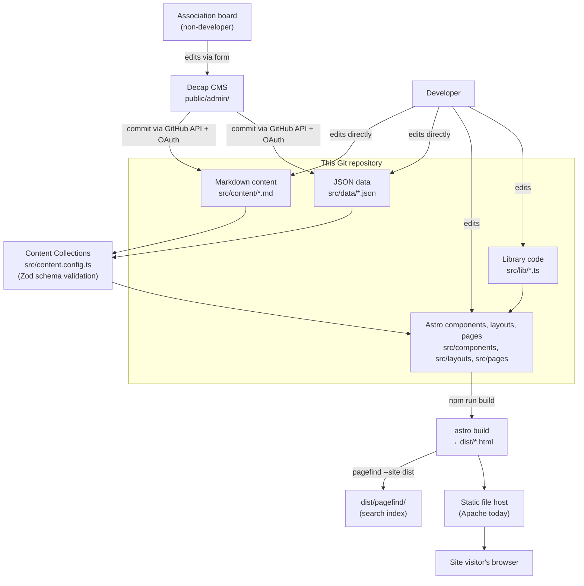

# Architecture

This page explains how the site is built and, where the reasoning is recorded in the repository, *why*. It expands on the [README's Architecture section](https://github.com/themantas1994/arla/blob/main/README.md#architecture) and the Portuguese rationale document [`docs/arquitetura.md`](https://github.com/themantas1994/arla/blob/main/docs/arquitetura.md), which this page draws directly from.

## System overview

## Rendering strategy

The site uses Astro's **static output** (no `output: 'server'` or `output: 'hybrid'` configured in `astro.config.mjs`), so every route is fully prerendered to HTML at build time. There is no server process handling requests in production, and no per-visitor computation — the same HTML is served to everyone.

Astro's defining trait — zero JavaScript shipped unless a component explicitly needs it — is used deliberately here. None of the site's `.astro` components use Astro's client-side framework integrations (there's no React/Vue/Svelte in `package.json`); interactivity is implemented with plain inline `<script>` tags scoped to the handful of components that need it:

| Component | Why it has a `<script>` |
| --- | --- |
| `Mapa.astro` | Lazily imports Leaflet and initializes the map only when it scrolls into view (`IntersectionObserver`) |
| `TabelaRepetidores.astro` | Client-side text search + band/mode filtering over the repeater/beacon table |
| `AlternarTema.astro` | Toggles and persists the light/dark theme choice |
| `Paginacao.astro`, `Partilhar.astro`, `BotaoCopiar.astro` | Small, single-purpose interactions (copy-to-clipboard, share, pagination controls) |
| Search page (`pesquisa.astro`) | Loads and queries the Pagefind index |

This matters concretely for the association's members: someone checking a repeater's frequency in the field, on a phone, with poor signal, is the primary use case the architecture is optimized for — see [Performance](Performance) for the measured effect.

## Routing

File-based routing under `src/pages/`. Two patterns are used:

- **Static routes** — a plain `.astro` file maps directly to a URL, e.g. `src/pages/contactos.astro` → `/contactos/`.
- **Dynamic, content-backed routes** — a file with bracketed params and an exported `getStaticPaths()` generates one page per matching entry, e.g. `src/pages/noticias/[...slug].astro` iterates the `noticias` collection.

`trailingSlash: 'always'` and `build: { format: 'directory' }` (both in `astro.config.mjs`) mean every route resolves to `.../index.html` under a directory named for the route, so all URLs consistently end in `/`.

See [Routing](Routing) for the complete table of every route in `src/pages/`.

## Component architecture

`src/components/` holds roughly twenty single-purpose `.astro` components (each is a `.astro` file combining its own markup, scoped `<style>`, and optional `<script>` — there's no separate CSS-in-JS or global stylesheet per component). `src/layouts/` holds three page shells that compose these components:

- **`Base.astro`** — the HTML document itself: `<head>` metadata (title, description, canonical, Open Graph, Twitter Card, JSON-LD), the inline dark/light theme script (must run before first paint to avoid a flash), header and footer.
- **`Pagina.astro`** — wraps `Base.astro` for long-form text pages (About ARLA, history, legal pages), optionally with a table of contents (`IndiceConteudos.astro`).
- **`Artigo.astro`** — wraps `Base.astro` for news/technical-article/event detail pages, adding author/date metadata, tags, related-content, and share/print affordances.

See [Components](Components) for the full catalog and conventions.

## Data flow

1. A content author changes a Markdown file (`src/content/*/`) or a JSON data file (`src/data/*.json`), either via `/admin/` (Decap CMS, which commits directly through the GitHub API) or by editing the file and committing normally.
2. At build time, Astro's Content Collections loader (`src/content.config.ts`) reads each file and **validates it against a Zod schema**. JSON files store their list wrapped in a named key (e.g. `{ "repetidores": [...] }`) rather than as a bare array, because Decap CMS can't edit a JSON file whose root is an array — a small parser (`listaEm()` in `content.config.ts`) unwraps this for Astro's loader.
3. Pages and components call helper functions in `src/lib/conteudo.ts` (e.g. `noticias()`, `eventosFuturos()`) or Astro's `getCollection()` directly to read the validated, typed data.
4. If a required field is missing or an enum value is invalid, **`npm run build` fails** with a specific `[InvalidContentEntryDataError]` naming the collection, entry, and field — publishing malformed data (like a repeater with no frequency) is not possible.

## Content architecture

Nothing editorial is hardcoded into components. See [Content Management](Content-Management) and [Repeater Data](Repeater-Data) for the full schemas; in short:

- **Markdown** (`src/content/noticias`, `tecnica`, `eventos`, `paginas`) for prose content.
- **JSON** (`src/data/*.json`) for structured records: repeaters, beacons, governing bodies, technical direction team, member list, history timeline, documents, links, FAQ, and site-wide settings (address, contacts, IBAN, membership fee).

## External services

By default, the site loads **no third-party resources at all** — no analytics, no web fonts (the type stack is the OS system font stack, `--fonte-base` in `global.css`), no social widgets. Three deliberate, deferred exceptions:

| What | Where | How it's loaded |
| --- | --- | --- |
| OpenStreetMap tiles | Any page with a `Mapa.astro` | Only once the map scrolls into view (`IntersectionObserver`) |
| HamQSL / NOAA space-weather panel images | `/radioamadorismo/meteorologia-espacial/` | `loading="lazy"`, `referrerpolicy="no-referrer"` |
| Decap CMS | `/admin/` | Admin-only page, excluded from `robots.txt` indexing |

[Leaflet](https://leafletjs.com) itself is **not** loaded from a CDN — it's an npm dependency, bundled with the site, and loaded via a dynamic `import()` only when a map is actually rendered.

## Build & deployment

`npm run build` runs two steps in sequence: `astro build` (generates `dist/`), then `pagefind --site dist` (indexes the generated HTML for search). Skipping the second step silently breaks search — there's no build-time error for it, just an empty index. See [Deployment](Deployment) for hosting-specific instructions, and [CI/CD](CI-CD) for the current (manual) state of automation.

## Documented architectural decisions

The following decisions are recorded with their alternatives in [`docs/arquitetura.md`](https://github.com/themantas1994/arla/blob/main/docs/arquitetura.md) (Portuguese); summarized here:

1. **Astro over Next.js, Hugo/Eleventy, or a hosted headless CMS** — chosen for zero-JS-by-default output, Zod-validated content collections, and no recurring cost or vendor lock-in for a non-profit association. Next.js's client-side framework overhead wasn't justified by the site's actual interactivity needs; Hugo/Eleventy lacked strong content typing.
2. **Git-backed content via Decap CMS, not a hosted headless CMS** — free, no dedicated backend, authenticates through GitHub, and content remains plain readable files even if the CMS itself were abandoned.
3. **Two-level information architecture, reorganized around visitor intent** (ARLA / Radioamadorismo / Rede ARLA / Notícias / Recursos / Contactos) instead of the WordPress site's four-level, org-chart-shaped navigation. The repeater network was promoted to a top-level section because it's the single most-requested piece of information for a member.
4. **Events split from news** — the WordPress site put both into one undifferentiated "post" type; the new schema gives events actual date fields and computed status instead of treating a Saturday activity the same as a legislative announcement.
5. **The legacy `arla.org.pt` domain link was removed**, because it no longer resolves in DNS — 176 images across migrated articles pointed there and were broken in production; the migration downloaded and rewrote those references to the new domain instead of leaving them dangling.
6. **Map positions computed from Maidenhead grid squares**, not invented coordinates — the association publishes grid locators for repeaters/beacons but not exact coordinates, so the map places a marker at the grid-square center and says so explicitly, both in the map's caption and in each marker's popup. No coverage polygons are drawn, since ARLA doesn't publish verified coverage studies.
7. **Pagefind for search** — builds its index from the final HTML with no server or third-party service, handles Portuguese diacritics well ("satelite" matches "satélite"), and only downloads index chunks when someone actually searches.
8. **No third-party resources in the critical path** — see the External Services table above.

## Future directions

Documented as *open paths, not implemented features* in `docs/arquitetura.md`:

- **A second language.** All UI strings live in components and all content lives in collections, so adding English would mean adding `src/content/noticias/en/` and enabling Astro's i18n routing — not a rewrite. Nothing i18n-related exists today.
- **Live repeater status.** The `estado` field is already typed and could be swapped from manually-edited to an automated data source without changing the UI, if the association ever gets one.
- **A hybrid/dynamic "área reservada" (members area) with real authentication.** Would require switching from Astro's static output to hybrid mode for that route only, adding an adapter — the rest of the site would stay static. Not implemented; `src/pages/area-reservada.astro` currently exists as a placeholder page.
- **Propagation or satellite-pass data.** Deliberately not added without a stable, reliable source; the space-weather page currently reproduces the same third-party panels the association used before.
