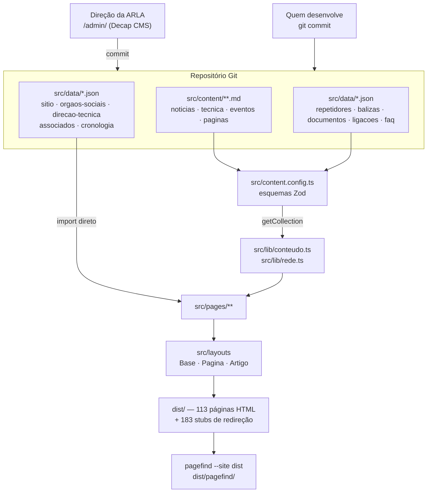

# Arquitetura

Como o sítio está montado, verificado contra o código em
`astro.config.mjs`, `src/content.config.ts`, `src/pages/`, `src/layouts/` e `src/lib/`.

Para as **razões** de cada decisão — porquê Astro, porquê conteúdo em Git, porquê nada de
terceiros no caminho crítico — ver [`docs/arquitetura.md`](../docs/arquitetura.md), que
regista também as alternativas postas de lado.

---

## Modelo de renderização — IMPLEMENTADO

O `astro.config.mjs` **não define `output`**, pelo que o Astro usa o modo estático: todas as
rotas são pré-renderizadas para HTML no build. Não há adaptador de servidor, não há rotas
servidas a pedido e não existe qualquer código do sítio a correr em produção.

Configuração relevante, tal como está no ficheiro:

```js
export default defineConfig({
  site,                                   // PUBLIC_SITE_URL ?? 'https://www.cs5arla.pt'
  trailingSlash: 'always',
  build: { format: 'directory', inlineStylesheets: 'auto' },
  prefetch: { prefetchAll: true, defaultStrategy: 'hover' },
  redirects,                              // importadas de src/lib/redirects.mjs
  integrations: [ sitemap({ /* … */ }) ],
  image: { responsiveStyles: true, layout: 'constrained' },
  markdown: { shikiConfig: { themes: { light: 'github-light', dark: 'github-dark' }, wrap: true } },
  vite: { build: { cssTarget: ['chrome107', 'safari16', 'firefox110'] } },
});
```

Consequências práticas:

- `trailingSlash: 'always'` + `build.format: 'directory'` → cada rota é servida como
  `.../index.html` e todos os endereços internos terminam em `/`. Uma ligação sem a barra
  final causa uma redireção desnecessária no servidor; escreva-as sempre com barra.
- `prefetch.prefetchAll` com estratégia `hover` → o Astro pré-carrega o HTML da página de
  destino quando o ponteiro passa sobre uma ligação interna.
- `inlineStylesheets: 'auto'` → folhas de estilo pequenas são embutidas no HTML; é por isso
  que o documento da página inicial pesa 141 kB e o CSS externo 48 kB.
- `cssTarget` limita a sintaxe CSS produzida a Chrome 107, Safari 16 e Firefox 110 — ao
  usar sintaxe mais recente (por exemplo `color-mix()`, que o projeto já usa), confirme que
  se mantém dentro deste alvo.

## Fluxo de conteúdo — IMPLEMENTADO



**Validação como rede de segurança.** Um campo obrigatório em falta ou um valor de enum
errado faz falhar `npm run build` com a coleção, a entrada e o campo identificados. Num sítio
que publica frequências usadas para sintonizar rádios, isto vale mais do que a comodidade de
publicar sempre.

**Dois caminhos para os dados JSON.** Cinco ficheiros de `src/data/` são coleções validadas
por Zod (`repetidores`, `balizas`, `documentos`, `ligacoes`, `faq`); os outros cinco
(`sitio`, `orgaos-sociais`, `direcao-tecnica`, `associados`, `cronologia`) são importados
diretamente pelas páginas, **sem validação de esquema**. Ver
[Coleções de Conteúdo](Colecoes-de-Conteudo.md#dados-fora-das-coleções).

## Encaminhamento — IMPLEMENTADO

Encaminhamento por ficheiros, sob `src/pages/`: 41 ficheiros de rota (40 `.astro` e um
`rss.xml.ts`). Rotas estáticas são ficheiros `.astro` simples; rotas de conteúdo usam
`getStaticPaths()`. Tabela completa em [Rotas](Rotas.md).

## Layouts e componentes — IMPLEMENTADO

Três layouts, em `src/layouts/`:

| Layout | Para que serve | Notas |
| --- | --- | --- |
| `Base.astro` | Documento HTML: `<head>`, metadados, JSON-LD `Organization`, cabeçalho, rodapé, região `aria-live` | Todas as outras páginas passam por aqui |
| `Pagina.astro` | Páginas de texto e de secção, com migalhas de pão e sobretítulo | Envolve `Base.astro` |
| `Artigo.astro` | Notícias e artigos técnicos, com autoria, índice lateral e conteúdo relacionado | Envolve `Base.astro` |

`src/components/` tem 19 componentes `.astro`, **todos em uso**. Catálogo em
[Componentes](Componentes.md).

## JavaScript no cliente — IMPLEMENTADO

O Astro não hidrata nada por predefinição e **este projeto não usa nenhuma diretiva
`client:*`** — não há ilhas. Toda a interatividade são blocos `<script>` em componentes
`.astro`, carregados apenas nas páginas que os usam:

| Comportamento | Onde | Como carrega |
| --- | --- | --- |
| Aplicar o tema antes da primeira pintura | `Base.astro` (`is:inline`) | Em linha, síncrono |
| Alternar tema e guardar em `localStorage` | `AlternarTema.astro` | Módulo, com a página |
| Menu e submenus do cabeçalho | `Cabecalho.astro` | Módulo, com a página |
| Pesquisa e filtros de repetidores | `TabelaRepetidores.astro` | Módulo, com a página |
| Copiar frequências e indicativos | `BotaoCopiar.astro` | Um só ouvinte delegado por página |
| Mapa Leaflet | `Mapa.astro` | `IntersectionObserver` + `import()` dinâmico |
| Pesquisa do sítio | `pesquisa.astro` | `import()` do índice Pagefind, a pedido |
| Filtros de arquivo e de associados | `arquivo.astro`, `quem-somos.astro` | Módulo, com a página |
| Partilhar (Web Share API, com alternativa) | `Partilhar.astro` | Módulo, com a página |
| Realce da secção ativa no índice | `IndiceConteudos.astro` | Módulo, com a página |

O resultado, medido: 5 kB de JavaScript na página inicial, 0 pedidos a terceiros.

## Serviços externos — IMPLEMENTADO

Nenhum carrega por predefinição. Três exceções, todas diferidas:

| O quê | Onde | Como |
| --- | --- | --- |
| Telas do OpenStreetMap | `Mapa.astro` | Só quando o mapa entra no ecrã (`rootMargin: '250px'`) |
| Painéis do HamQSL e NOAA | `/radioamadorismo/meteorologia-espacial/` | `loading="lazy"`, com `referrerpolicy="no-referrer"` |
| Decap CMS | `/admin/` | `https://unpkg.com/decap-cms@^3.8.4`, fora do sítio público |

O Leaflet **não** vem de um CDN: é dependência do projeto e é carregado por `import()`
dinâmico, juntamente com o seu CSS.

## Build — IMPLEMENTADO

```bash
npm run build   # astro build && pagefind --site dist
```

O Pagefind corre **depois** do Astro, sobre o HTML gerado. Indexa apenas o que está dentro
de `<main data-pagefind-body>`; o cabeçalho e o rodapé estão marcados com
`data-pagefind-ignore` em `Base.astro`, e páginas utilitárias passam `semIndexacao` ou
`semPesquisa` para ficarem de fora. O build de referência desta auditoria indexou 108
páginas e 5636 palavras.

## Evolução futura

Caminhos que a arquitetura deixa abertos, **nenhum deles implementado**:

- **Segundo idioma — PROPOSTA.** Os textos de interface estão nos componentes e o conteúdo
  em coleções; acrescentar inglês passaria por criar `src/content/noticias/en/` e ativar o
  encaminhamento i18n do Astro.
- **Estado dos repetidores em tempo real — PROPOSTA.** O campo `estado` já existe e está
  tipado; bastaria trocar a origem do dado sem mexer na interface.
- **Área reservada com autenticação — NÃO IMPLEMENTADO.** Exigiria uma parte dinâmica: um
  adaptador e essas rotas servidas a pedido. Hoje `/area-reservada/` é uma página estática
  que explica que o sistema de contas do WordPress não transitou.
- **Otimização de imagens no build — NÃO IMPLEMENTADO.** As definições `image` existem em
  `astro.config.mjs`, mas nenhuma página usa `<Image>`/`getImage()`. Ver
  [Media e Imagens](Media-e-Imagens.md).
