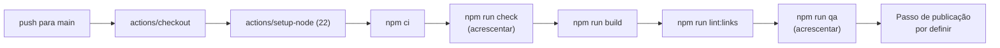

# CI/CD

## Estado atual

> **Não existe atualmente um pipeline CI/CD automatizado neste repositório.**

Isto é uma afirmação factual sobre o repositório tal como está hoje, verificada nesta
auditoria — não um lapso de documentação a contornar. Em concreto:

- **não existe o diretório `.github/`**, e portanto não há workflows do GitHub Actions;
- não há configuração de nenhum outro sistema de integração contínua (GitLab CI, Jenkins,
  Travis, CircleCI);
- não há ficheiros de verificações obrigatórias, de proteção de branch nem de revisão
  automática visíveis no repositório;
- não há `npm test` — não existe sequer um guião com esse nome em `package.json`.

Em consequência, **tudo é corrido à mão** por quem desenvolve, antes de publicar:

```bash
npm run check
npm run build
npm run preview &
npm run lint:links
npm run qa
npm run audit:seo
npm run audit:desempenho
```

E a publicação é igualmente manual: envio do conteúdo de `dist/` para o alojamento Apache.
Ver [Implantação](Implantacao.md) e [Testes e Qualidade](Testes-e-Qualidade.md).

---

## Proposta (NÃO IMPLEMENTADA)

[`docs/implantacao.md`](../docs/implantacao.md#publicação-automática--não-implementada)
regista um workflow como ponto de partida. **Não está no repositório e nunca correu:**

```yaml
name: Publicar
on:
  push:
    branches: [main]
  workflow_dispatch:

jobs:
  publicar:
    runs-on: ubuntu-latest
    steps:
      - uses: actions/checkout@v4
      - uses: actions/setup-node@v4
        with:
          node-version: 22
          cache: npm
      - run: npm ci
      - run: npm run build
      - run: npm run lint:links
      # Substituir pelo passo de publicação do alojamento escolhido.
      - uses: actions/upload-artifact@v4
        with:
          name: sitio
          path: dist
```



O diagrama descreve um **estado futuro possível**. Nada nele está a correr.

---

## Se for para implementar

1. **Fixe o Node em 22**, para corresponder ao `.nvmrc`. O `engines.node` do `package.json`
   só exige `>=20.3`, o que é mais permissivo do que aquilo contra o qual o projeto é
   realmente desenvolvido e testado.
2. **Acrescente `npm run check`** antes do build. A proposta acima salta-o, e é a
   verificação mais barata que existe.
3. **Pondere `npm run qa` e `npm run audit:seo`.** São as verificações em que este projeto
   realmente se apoia; um pipeline que as salte é mais fraco do que o processo manual que
   substitui. Precisam de um Chromium no runner (`npx playwright install --with-deps
   chromium`, ou uma imagem que já o traga) e do sítio servido — normalmente
   `npm run preview &` seguido de uma espera pela porta 4321.
4. **Decida o passo de publicação.** A proposta termina em `upload-artifact` de propósito,
   porque cada alojamento tem mecânica diferente e implicações diferentes nas redireções
   (ver [Implantação](Implantacao.md)). Para o Apache/cPanel atual, seria um passo de
   FTP/SFTP — e **o `.htaccess` tem de ir junto**, o que muitos clientes de FTP omitem por
   ser um ficheiro oculto.
5. **Guarde as credenciais de publicação como secrets do repositório**, nunca no workflow.
6. **Considere `npm audit`** como passo informativo — hoje reporta 3 vulnerabilidades em
   dependências (ver [Segurança](Seguranca.md)), e convém que isso não passe despercebido.
7. **Não faça o build falhar por causa das ligações externas.** O `npm run lint:links` sem
   `--externas` verifica apenas ligações internas, que é o comportamento certo para um
   pipeline: 14 das ligações externas do sítio estão mortas dentro de artigos de arquivo,
   por decisão editorial.

---

## O que a automatização mudaria na prática

O ganho maior não seria a verificação — que já é feita, ainda que à mão — mas fechar a
lacuna entre o CMS e o sítio publicado: hoje, uma alteração gravada em `/admin/` fica no
repositório **sem chegar ao sítio** até alguém correr o build e publicar. É o que torna a
frase «depois de gravar, o sítio atualiza-se sozinho» incorreta, e é a razão pela qual vale
a pena implementar isto.

Ver [`docs/auditoria-do-projeto.md`](../docs/auditoria-do-projeto.md#recomendações-futuras).
