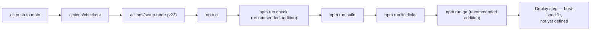

# CI/CD

## Current state: none

**There is no `.github/workflows/` directory in this repository, and no CI/CD system of any kind is currently configured.** This is a factual statement about the repository as it exists today, not an oversight to read past — if you're looking for a pipeline to fix or extend, there isn't one yet to find.

Concretely, today:
- Type checking (`npm run check`), the build (`npm run build`), link checking (`npm run lint:links`), accessibility/functional QA (`npm run qa`), SEO auditing (`npm run audit:seo`), and performance auditing (`npm run audit:desempenho`) are all run **manually** by a developer before deploying — see [Testing](Testing).
- Deployment is a manual upload of `dist/` to the Apache host — see [Deployment](Deployment).
- There is no `Claude Approvals`, no branch protection rule enforcement visible in the repository config, and no automated PR checks.

## The suggested (not implemented) workflow

[`docs/implantacao.md`](https://github.com/themantas1994/arla/blob/main/docs/implantacao.md#publicação-automática) documents a *proposed* GitHub Actions workflow, presented explicitly as a starting point rather than something already in place:

```yaml
name: Publicar
on:
  push:
    branches: [main]
  workflow_dispatch:

jobs:
  publicar:
    runs-on: ubuntu-latest
    steps:
      - uses: actions/checkout@v4
      - uses: actions/setup-node@v4
        with:
          node-version: 22
          cache: npm
      - run: npm ci
      - run: npm run build
      - run: npm run lint:links
      # Replace with the actual deployment step for your chosen host.
      - uses: actions/upload-artifact@v4
        with:
          name: sitio
          path: dist
```

The `npm run lint:links` step is called out specifically as a cheap safety net: if a content change introduces a broken link, the build fails before it reaches production.

## If you implement this

Before adding `.github/workflows/publicar.yml` (or similar) to the repository:

1. Confirm the Node version matches `.nvmrc` (22) — the `engines.node` field in `package.json` only requires `>=20.3`, so pin explicitly to 22 in CI to match what's actually developed/tested against.
2. Decide on the actual deployment step for whichever host is chosen — the workflow above stops at `upload-artifact` deliberately, since [Deployment](Deployment) documents multiple viable hosts (Apache/cPanel today, or Netlify/Cloudflare Pages/Vercel/GitHub Pages) with different deployment mechanics and different redirect-format implications.
3. Consider adding `npm run check` (type checking) and, for a more thorough gate, `npm run qa`/`npm run audit:seo` — these currently only run manually and are the main quality gates this project actually relies on (see [Testing](Testing)); a CI pipeline that skips them would be weaker than the manual process it replaces.
4. There is no existing Claude Approvals or required-status-check configuration to integrate with in this repository — if your organization wants one, it would be new setup, not something to extend.

## Mermaid: proposed pipeline shape



This diagram describes a **possible future state**, matching the workflow suggested in `docs/implantacao.md` plus the additional gates recommended above — it does not describe anything currently running.
