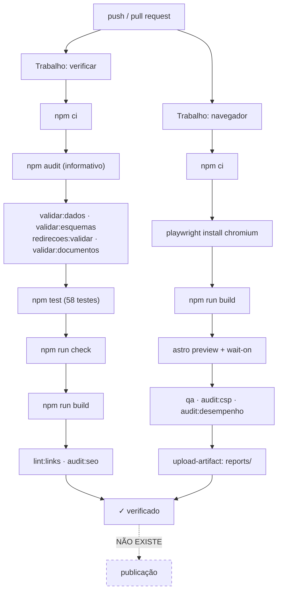

# CI/CD

## Estado atual

> **Integração contínua: IMPLEMENTADA.**
> **Publicação automática: NÃO IMPLEMENTADA.**

A distinção é importante e não é um jogo de palavras: a partir da remediação da auditoria,
cada alteração é **verificada** automaticamente, mas **nenhuma é publicada**
automaticamente. A lacuna entre o CMS e o sítio publicado continua lá.

O workflow vive em `.github/workflows/qualidade.yml` e corre a cada *push* em qualquer
branch, a cada *pull request*, e a pedido (`workflow_dispatch`).

### Trabalho `verificar`

Tudo o que não precisa de navegador. Pela ordem em que corre:

| Passo | Comando | Porque está nesta ordem |
| --- | --- | --- |
| Vulnerabilidades | `npm audit --audit-level=moderate \|\| true` | informativo; não faz falhar (ver [Segurança](Seguranca.md)) |
| Dados | `npm run validar:dados` | é o mais barato e apanha erros de conteúdo |
| CMS ↔ esquemas | `npm run validar:esquemas` | idem; apanha divergências antes de o build as encontrar |
| Redireções | `npm run redirecoes:validar` | idem |
| Documentos | `npm run validar:documentos` | idem |
| Testes unitários | `npm test` | segundos, e falha cedo numa regressão de lógica |
| Tipos | `npm run check` | a verificação mais barata antes do build |
| Build | `npm run build` | tudo o que vem a seguir precisa do `dist/` |
| Ligações e SEO | `npm run lint:links`, `npm run audit:seo` | correm sobre o `dist/` |

### Trabalho `navegador`

Corre em paralelo, porque é o lento. Instala o Chromium do Playwright
(`npx playwright install --with-deps chromium`), serve o build com `astro preview` e espera
pela porta com `wait-on` antes de correr `qa`, `audit:csp` e `audit:desempenho`.

**`CHROMIUM_PATH` não é definido**, de propósito: sem a variável e sem
`/opt/pw-browsers/chromium`, os guiões usam o navegador que o Playwright acabou de instalar
— ver [Variáveis de Ambiente](Variaveis-de-Ambiente.md).

O `reports/` é guardado como artefacto mesmo quando um passo falha (`if: always()`), porque
é lá que está o detalhe de qualquer violação de acessibilidade ou métrica de desempenho.

---

## Porque não publica

Não há nenhum passo de implantação, e o workflow **não usa nenhum segredo**. Isto é
deliberado, não um esquecimento:

- o alojamento atual é Apache/cPanel, e publicar exigiria credenciais de FTP/SFTP guardadas
  como *secrets* do repositório;
- quem deve controlar a publicação do sítio da associação é uma decisão da direção, não uma
  escolha técnica;
- inventar credenciais ou um destino de publicação para o pipeline «ficar completo» seria
  pior do que não o ter.

As opções e o que cada uma implica estão em
[`docs/decisoes-pendentes.md`](../docs/decisoes-pendentes.md#3-a-publicação-continua-manual-ou-passa-a-automática).

**Enquanto for assim, a publicação é manual:** `npm run build` e envio de `dist/` para o
alojamento. Ver [Implantação](Implantacao.md).

---

## Se for para acrescentar publicação

1. **Decida primeiro o destino.** Para o Apache/cPanel atual, um passo de FTP/SFTP — e **o
   `.htaccess` tem de ir junto**, o que muitos clientes de FTP omitem por ser um ficheiro
   oculto. Para Netlify ou Cloudflare Pages, a publicação vem incluída e o `_redirects` é
   lido sem configuração (e o Git Gateway resolveria também a autenticação do CMS).
2. **Guarde as credenciais como *secrets* do repositório**, nunca no ficheiro do workflow.
3. **Publique só a partir da branch publicada**, o que exige decidir qual é — ver
   [`docs/decisoes-pendentes.md`](../docs/decisoes-pendentes.md#1-qual-é-a-branch-publicada-do-sítio).
4. **Mantenha a publicação num trabalho separado**, dependente dos dois existentes
   (`needs: [verificar, navegador]`), para nunca publicar um build que não passou nas
   verificações.
5. **Não faça falhar por ligações externas.** O `npm run lint:links` sem `--externas`
   verifica apenas ligações internas, que é o comportamento certo aqui: 14 das ligações
   externas do sítio estão mortas dentro de artigos de arquivo, por decisão editorial.

---

## O que a automatização da publicação mudaria

Fecharia a lacuna entre o CMS e o sítio publicado: hoje, uma alteração gravada em `/admin/`
fica no repositório **sem chegar ao sítio** até alguém correr o build e publicar. É o que
torna incorreta a frase «depois de gravar, o sítio atualiza-se sozinho», e é a razão pela
qual vale a pena — depois de tomada a decisão.

Ver [`docs/remediacao-da-auditoria.md`](../docs/remediacao-da-auditoria.md).
