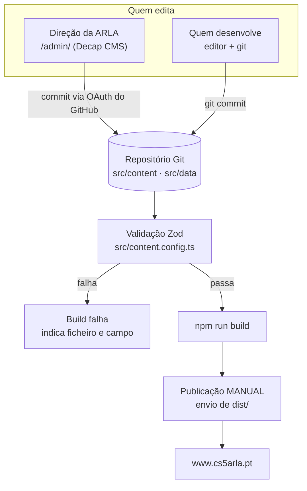

# Gestão de Conteúdos

Versão para quem desenvolve. O guia para a direção da associação — passo a passo, sem
pressupor conhecimentos técnicos — está em
[`docs/gestao-de-conteudos.md`](../docs/gestao-de-conteudos.md).

---

## O princípio

**Nada de editorial está escrito no código.** Todo o conteúdo vive neste repositório como
ficheiros de texto:

- **Markdown** (`src/content/`) para o que é texto corrido;
- **JSON** (`src/data/`) para o que é estrutura.

Duas consequências que convêm ter presentes:

1. **O conteúdo sobrevive às ferramentas.** Se o Decap CMS desaparecer amanhã, o conteúdo
   continua legível e editável num editor de texto.
2. **Cada alteração é um commit.** Vê-se quem mudou o quê e quando, e reverte-se.

---

## Os dois caminhos



**O último passo é manual.** Não existe publicação automática: gravar no CMS faz commit,
mas não atualiza o sítio. Ver [CI/CD](CI-CD.md).

---

## O que é editável, e onde

| Conteúdo | Ficheiro | No CMS? | Validado por Zod? |
| --- | --- | --- | --- |
| Notícias | `src/content/noticias/*.md` | Sim, criar e apagar | Sim |
| Artigos técnicos | `src/content/tecnica/*.md` | Sim, criar e apagar | Sim |
| Eventos | `src/content/eventos/*.md` | Sim, criar e apagar | Sim |
| Páginas de texto | `src/content/paginas/*.md` | Sim, **só editar** | Sim |
| Repetidores | `src/data/repetidores.json` | Sim | Sim |
| Balizas | `src/data/balizas.json` | Sim | Sim |
| Documentos | `src/data/documentos.json` | Sim | Sim |
| Ligações úteis | `src/data/ligacoes.json` | Sim | Sim |
| Perguntas frequentes | `src/data/faq.json` | Sim | Sim |
| Contactos, IBAN, quota | `src/data/sitio.json` | Sim | **Não** |
| Órgãos sociais | `src/data/orgaos-sociais.json` | Sim | **Não** |
| Direção técnica | `src/data/direcao-tecnica.json` | Sim | **Não** |
| Lista de associados | `src/data/associados.json` | Sim | **Não** |
| Cronologia | `src/data/cronologia.json` | Sim | **Não** |
| **Menu de navegação** | `src/lib/navegacao.ts` | **Não** | — |
| **Textos de interface** | Componentes `.astro` | **Não** | — |
| **Páginas estáticas** | `src/pages/**.astro` | **Não** | — |
| **Redireções** | `redirects.mjs`, `.htaccess`, `_redirects` | **Não** | — |

Os cinco ficheiros JSON sem validação Zod são importados diretamente pelas páginas. Um campo
mal escrito aí não faz falhar o build — aparece como `undefined` na página. É a diferença
que mais surpreende quem chega ao projeto.

---

## Política editorial

Está codificada no modelo de dados, e vale a pena respeitá-la ao acrescentar
funcionalidades:

- **Nada é apagado por ter envelhecido.** Conteúdo datado é marcado com `historico: true` e
  uma `notaHistorica`; o artigo continua publicado, ligável e pesquisável, com um aviso de
  contexto.
- **Eventos passados não se apagam** — o arquivo é parte da história da associação. Um
  evento cancelado marca-se com `cancelado: true`.
- **Ligações mortas dentro de artigos migrados não se corrigem.** Reescrevê-las seria
  alterar o registo do que a ARLA publicou na altura. Ver
  [`docs/qualidade.md`](../docs/qualidade.md#ligações).
- **Nada é inventado.** Onde faltava informação na migração, ficou o campo vazio ou uma nota
  explícita — nunca um valor plausível. A lista do que falta confirmar está em
  [`docs/carece-de-verificacao.md`](../docs/carece-de-verificacao.md).
- **Nenhuma posição é apresentada como mais precisa do que a fonte permite.** Os repetidores
  e balizas são colocados no centro da quadrícula, e o mapa diz que a posição é aproximada.

---

## Validação — a rede de segurança

```bash
npm run build
```

Um campo obrigatório em falta ou um valor de enum inválido faz falhar o build, com a
coleção, a entrada e o campo identificados:

```text
[InvalidContentEntryDataError] eventos → workshop-2026
  inicio: Required
```

Isto é intencional. Para um sítio que publica frequências usadas para sintonizar rádios,
falhar o build é melhor do que publicar dados incompletos.

**O que a validação não apanha:**

- dados corretos na forma e errados no conteúdo (uma frequência bem formatada mas errada);
- `filtros` incompleto num repetidor — aparece na tabela e desaparece ao filtrar;
- erros nos cinco ficheiros JSON fora das coleções;
- `id` duplicado dentro de uma coleção de dados;
- `tamanho` de um documento que já não corresponde ao ficheiro.

---

## Acrescentar um tipo de conteúdo

Passo a passo em
[Coleções de Conteúdo](Colecoes-de-Conteudo.md#acrescentar-uma-coleção-nova). O essencial:
uma coleção nova toca em **quatro** sítios — `src/content.config.ts`, uma rota em
`src/pages/`, `public/admin/config.yml` e, se for para aparecer no menu,
`src/lib/navegacao.ts`.

**Manter o `content.config.ts` e o `config.yml` em concordância é manual**, e é a fonte de
erros mais provável ao mexer no modelo de conteúdos. Ver
[CMS Decap](CMS-Decap.md#manter-o-cms-e-o-esquema-alinhados).
