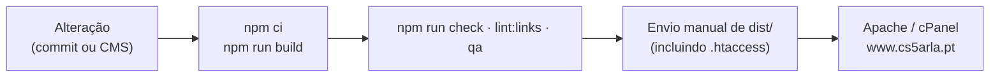

# Implantação

O artefacto de produção é uma pasta de ficheiros estáticos — `dist/` — servida por qualquer
servidor Web. Não há runtime, base de dados nem processo a manter vivo.

Esta página distingue três coisas que não devem ser confundidas: **o que é usado hoje**, **o
que o repositório suporta** e **o que é apenas proposta**.

---

## Build

```bash
npm ci                # instalação limpa, a partir do package-lock.json
npm run build         # astro build && pagefind --site dist
```

As duas metades contam. O `astro build` gera o HTML/CSS/JS; o `pagefind --site dist`
percorre esse HTML e constrói o índice de pesquisa em `dist/pagefind/`. **Publicar só a
saída do `astro build` deixa a pesquisa vazia, sem erro visível.**

Para publicar noutra origem:

```bash
PUBLIC_SITE_URL=https://ensaio.exemplo.pt npm run build
```

Afeta canónicos, Open Graph, sitemap e RSS — mas **não** o `robots.txt`, que tem o endereço
do sitemap escrito literalmente.

### Verificar antes de publicar

```bash
npm run check
npm run preview &
npm run lint:links
npm run qa
npm run audit:seo
```

---

## Implantação atual — IMPLEMENTADO

**Apache com cPanel**, o mesmo ambiente onde o WordPress corria. O processo é **manual**:

1. `npm run build`
2. Enviar **todo o conteúdo de `dist/`** para a raiz pública (`public_html/` ou equivalente).
3. **Confirmar que o `.htaccess` foi mesmo enviado** — é um ficheiro oculto e muitos
   clientes de FTP escondem-no. Sem ele não há redireções 301 nem cabeçalhos de segurança.
4. Confirmar que `mod_rewrite` e `mod_headers` estão ativos (estão, na maioria dos
   alojamentos partilhados).

Sobre a pasta `/site/` do WordPress antigo: guardar uma cópia de segurança completa antes de
lhe tocar; depois de confirmar que o sítio novo e as redireções respondem, a instalação
antiga pode ser removida. As redireções tratam dos endereços antigos.



O passo manual é o elo frágil desta cadeia: enquanto não houver publicação automática, uma
alteração gravada no CMS fica no repositório sem chegar ao sítio.

---

## Alternativas suportadas — NÃO UTILIZADAS HOJE

O repositório está preparado para estas, mas nenhuma está em uso.

### Netlify ou Cloudflare Pages

| Definição | Valor |
| --- | --- |
| Comando de build | `npm run build` |
| Pasta a publicar | `dist` |
| Versão do Node | `22` |

O `public/_redirects` é reconhecido automaticamente pelas duas plataformas. Cada envio para
a branch principal publica uma versão nova. A Netlify traz ainda o *Git Gateway*, que é o
caminho mais simples para a autenticação do CMS.

### Vercel

Mesmo comando e mesma pasta, com uma diferença importante: **a Vercel não lê o
`_redirects`**. As páginas-stub do Astro continuam a funcionar, pelo que nenhum endereço
antigo fica partido, mas usam `meta refresh` em vez de 301 real. Para 301 reais seria
preciso um `vercel.json` traduzido a partir de `src/lib/redirects.mjs`.

### GitHub Pages

Funciona, com a limitação mais séria: **não há redireções ao nível do servidor**. As 190
regras passariam todas a depender das páginas-stub com `meta refresh` — pior para uma década
de ligações acumuladas. Para este sítio em concreto, prefira um alojamento com 301 reais.

---

## Publicação automática — NÃO IMPLEMENTADO

**Não existe atualmente um pipeline CI/CD automatizado neste repositório.** Ver
[CI/CD](CI-CD.md) para o estado exato e para a proposta de workflow registada em
[`docs/implantacao.md`](../docs/implantacao.md#publicação-automática--não-implementada).

---

## Editor de conteúdos — PARCIALMENTE IMPLEMENTADO

O Decap CMS está configurado (`public/admin/config.yml`) e funciona localmente com
`npx decap-server`. Para funcionar em produção faltam duas coisas, **nenhuma delas dentro
deste repositório**:

1. uma **aplicação OAuth do GitHub**, com o *Client Secret* guardado fora do repositório;
2. um **serviço de autenticação** que troque o código de autorização por um token — o *Git
   Gateway* da Netlify, ou um serviço de OAuth para Decap noutro alojamento, indicado em
   `base_url`.

Passo a passo em [`docs/implantacao.md`](../docs/implantacao.md#configurar-o-editor-de-conteúdos)
e detalhe técnico em [CMS Decap](CMS-Decap.md).

---

## Lista de verificação de publicação

- [ ] `npm run check` sem erros
- [ ] `npm run build` termina, incluindo o passo do Pagefind
- [ ] `npm run lint:links` sem ligações internas partidas
- [ ] `npm run qa` sem violações de acessibilidade
- [ ] `dist/` enviado por inteiro, **incluindo `.htaccess`**
- [ ] `dist/pagefind/` presente no alojamento (senão, a pesquisa fica vazia)
- [ ] Testar um endereço antigo (`/site/repetidores/`) e confirmar o 301
- [ ] Testar a página inicial, a de repetidores e a pesquisa no sítio publicado
- [ ] Limpar a cache da CDN, se existir

---

## Quando o sítio não atualiza

1. Confirmar que o build foi mesmo corrido **e publicado**: não há publicação automática.
2. Forçar a atualização no navegador (`Ctrl`+`F5` / `Cmd`+`Shift`+`R`).
3. Limpar a cache da CDN ou da Cloudflare, se existir. Note que o `.htaccess` define
   `Cache-Control: max-age=31536000, immutable` para recursos estáticos — os nomes dos
   ficheiros gerados pelo Astro incluem um hash, pelo que isso é seguro, mas ficheiros de
   `public/` com o mesmo nome podem ficar em cache durante muito tempo.
4. Confirmar no Git que a alteração ficou mesmo gravada.

Mais casos em [Resolução de Problemas](Resolucao-de-Problemas.md).
