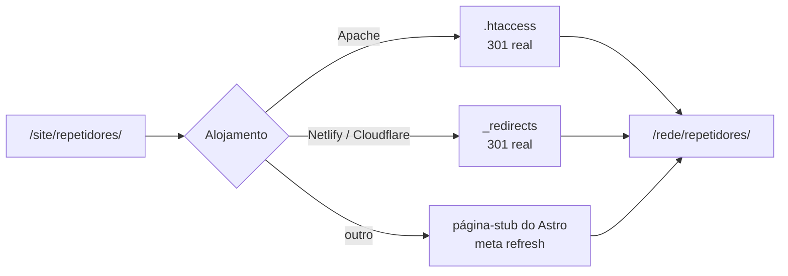

# Redirecionamentos

O sítio WordPress anterior esteve publicado em `https://www.cs5arla.pt/site/` durante anos.
As ligações partilhadas em fóruns, mensagens e marcadores continuam a apontar para lá, e o
objetivo é que nenhuma delas fique partida.

**A documentação anterior indicava «189 redireções», o que não correspondia aos ficheiros.**
Os números abaixo foram contados sobre o código nesta auditoria.

---

## Os números

| Ficheiro | Regras | Composição |
| --- | --- | --- |
| `src/lib/redirects.mjs` | **183** | 93 endereços de rota distintos: 90 em duas variantes (com e sem `/site/`) + 3 só com `/site/` |
| `public/.htaccess` | **190** `RewriteRule … [R=301,L]` | As 183 + 6 para ficheiros PDF + 1 regra final de recolha (`^site/?$` → `/`) |
| `public/_redirects` | **190** linhas | As 183 + 6 para ficheiros PDF + 1 regra de recolha (`/site/*` → `/`) |

As três exceções sem variante bare são `/site/`, `/site/contactos/` e `/site/noticias/` — a
versão sem prefixo desses endereços é uma página do sítio novo.

Verificado nesta auditoria: **nenhum ciclo, nenhuma auto-redireção e nenhum destino que
seja, ele próprio, a origem de outra redireção.** Os destinos dos três ficheiros coincidem
regra a regra.

O mapa completo, endereço a endereço, está em
[`docs/mapa-de-redirecoes.md`](../docs/mapa-de-redirecoes.md).

---

## Como funcionam, por alojamento

| Formato | Ficheiro | Usado por | O que produz |
| --- | --- | --- | --- |
| Configuração `redirects` do Astro | `astro.config.mjs`, que importa `src/lib/redirects.mjs` | Qualquer alojamento de ficheiros estáticos | Páginas-stub com `meta refresh` e `<link rel="canonical">` |
| `mod_rewrite` do Apache | `public/.htaccess` | **Apache — o alojamento atual** | 301 reais, ao nível do servidor |
| Formato Netlify | `public/_redirects` | Netlify, Cloudflare Pages | 301 reais, ao nível do servidor |

No alojamento atual, o `.htaccess` é o que conta: o Apache responde 301 antes de o Astro
chegar a servir a página-stub. As páginas-stub são a rede de segurança para alojamentos sem
redireções ao nível do servidor.



---

## Ficheiros PDF e regra de recolha

Três PDF têm redireção em duas variantes cada (com e sem `/site/`), num total de 6 regras:

```text
/estatutos_arla.pdf              → /documentos/estatutos-arla.pdf
/regulamentos_internos.pdf       → /documentos/regulamentos-internos.pdf
/ARLA_ficha_de_inscrição.pdf     → /documentos/arla-ficha-de-inscricao.pdf
```

**Existem apenas ao nível do servidor**, não em `redirects.mjs`: gerar uma página HTML num
caminho terminado em `.pdf` confundiria quem o descarregasse.

A regra final de recolha manda qualquer outro endereço sob `/site/` para a página inicial.
Também só existe ao nível do servidor, e tem de ficar **no fim** do ficheiro, para não
apanhar os endereços específicos.

---

## Manutenção — atenção

**Os três ficheiros são mantidos à mão e não há geração automática.** `src/lib/redirects.mjs`
é a referência, mas não gera o `.htaccess` nem o `_redirects`. Isto é dívida técnica
conhecida: acrescentar uma redireção só num dos ficheiros produz um comportamento diferente
consoante o alojamento — e, no alojamento atual, uma redireção só em `redirects.mjs` fica a
funcionar por `meta refresh` em vez de 301 real.

### Acrescentar uma redireção

1. `src/lib/redirects.mjs`:
   ```js
   '/endereco/antigo/': { status: 301, destination: '/endereco/novo/' },
   ```
   Se o endereço antigo também existia sob `/site/`, acrescente as duas variantes.
2. `public/.htaccess`, **antes** da regra de recolha:
   ```apache
   RewriteRule ^endereco/antigo/$ /endereco/novo/ [R=301,L]
   ```
3. `public/_redirects`, **antes** da linha `/site/*`:
   ```text
   /endereco/antigo/  /endereco/novo/  301
   ```
4. `docs/mapa-de-redirecoes.md` — acrescente a linha à tabela da secção certa e atualize a
   contagem.
5. `npm run build && npm run lint:links` — o verificador de ligações confirma que o destino
   existe.

### Quando é preciso acrescentar uma

- Ao **renomear um ficheiro** de conteúdo (o nome do ficheiro é o slug do endereço).
- Ao **mudar a ortografia de uma categoria** de notícias — o endereço
  `/noticias/categoria/[slug]/` muda com ela.
- Ao **remover ou fundir** uma página.

### Verificação

```bash
npm run build
npm run lint:links     # confirma que nenhum destino está partido
```

O teste funcional em `npm run qa` também verifica, num navegador real, que
`/site/repetidores/` chega a `/rede/repetidores/`.

Para confirmar que os três ficheiros continuam a concordar, o mais direto é comparar as
chaves — um `node -e` sobre `redirects.mjs` e um `grep` sobre os outros dois. Automatizar
esta verificação é uma melhoria por fazer; ver
[`docs/auditoria-do-projeto.md`](../docs/auditoria-do-projeto.md#recomendações-futuras).

---

## Cuidados

- **O `.htaccess` é um ficheiro oculto.** Muitos clientes de FTP escondem-no por
  predefinição. Sem ele, no alojamento atual, não há 301 nem cabeçalhos de segurança.
- **A Vercel não lê `_redirects`.** Seria preciso um `vercel.json` traduzido a partir de
  `redirects.mjs`.
- **O GitHub Pages não tem redireções ao nível do servidor.** Todas as 190 regras
  passariam a depender das páginas-stub com `meta refresh`, pior para o posicionamento nos
  motores de busca.
- **As páginas-stub inflacionam a contagem de ficheiros do build:** dos 296 ficheiros HTML
  em `dist/`, 183 são stubs. É também a origem dos avisos «has no `<html>` element» do
  Pagefind durante o build — esperados, não um problema.
