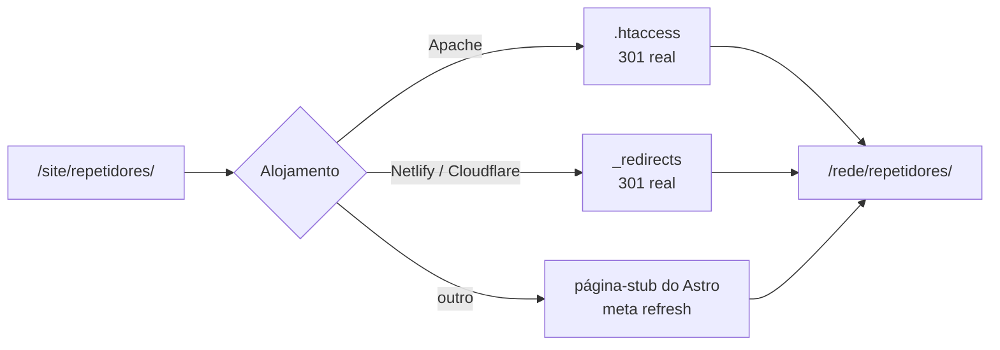

# Redirecionamentos

O sítio WordPress anterior esteve publicado em `https://www.cs5arla.pt/site/` durante anos.
As ligações partilhadas em fóruns, mensagens e marcadores continuam a apontar para lá, e o
objetivo é que nenhuma delas fique partida.

**`src/lib/redirects.mjs` é a fonte única e gera os dois ficheiros de servidor.**
Os números abaixo são produzidos por `npm run redirecoes:validar`.

---

## Os números

| Exportação de `redirects.mjs` | Regras | O que é |
| --- | --- | --- |
| `redirects` | **183** | 93 endereços de rota distintos: 90 em duas variantes (com e sem `/site/`) + 3 só com `/site/`. Entregue ao Astro em `astro.config.mjs` |
| `redirecoesDeFicheiros` | **7** | 3 PDF do sítio antigo, em duas variantes, + o nome alternativo `hamRadio.mp4` |
| `capturaFinal` | **1** | recolha de `/site/*` |
| **Total** | **191** | o que `public/.htaccess` e `public/_redirects` contêm, gerado |

As três exceções sem variante bare são `/site/`, `/site/contactos/` e `/site/noticias/` — a
versão sem prefixo desses endereços é uma página do sítio novo.

Verificado a cada execução de `npm run redirecoes:validar`: **nenhum ciclo, nenhuma
auto-redireção e nenhum destino que seja, ele próprio, a origem de outra redireção.** Os
destinos dos três ficheiros coincidem regra a regra, por construção.

O mapa completo, endereço a endereço, está em
[`docs/mapa-de-redirecoes.md`](../docs/mapa-de-redirecoes.md).

---

## Como funcionam, por alojamento

| Formato | Ficheiro | Usado por | O que produz |
| --- | --- | --- | --- |
| Configuração `redirects` do Astro | `astro.config.mjs`, que importa `src/lib/redirects.mjs` | Qualquer alojamento de ficheiros estáticos | Páginas-stub com `meta refresh` e `<link rel="canonical">` |
| `mod_rewrite` do Apache | `public/.htaccess` | **Apache — o alojamento atual** | 301 reais, ao nível do servidor |
| Formato Netlify | `public/_redirects` | Netlify, Cloudflare Pages | 301 reais, ao nível do servidor |

No alojamento atual, o `.htaccess` é o que conta: o Apache responde 301 antes de o Astro
chegar a servir a página-stub. As páginas-stub são a rede de segurança para alojamentos sem
redireções ao nível do servidor.



---

## Ficheiros PDF e regra de recolha

Três PDF têm redireção em duas variantes cada (com e sem `/site/`), num total de 6 regras:

```text
/estatutos_arla.pdf              → /documentos/estatutos-arla.pdf
/regulamentos_internos.pdf       → /documentos/regulamentos-internos.pdf
/ARLA_ficha_de_inscrição.pdf     → /documentos/arla-ficha-de-inscricao.pdf
```

**Existem apenas ao nível do servidor**, não em `redirects.mjs`: gerar uma página HTML num
caminho terminado em `.pdf` confundiria quem o descarregasse.

A regra final de recolha manda qualquer outro endereço sob `/site/` para a página inicial.
Também só existe ao nível do servidor, e o gerador coloca-a sempre **no fim**, para não
apanhar os endereços específicos.

Até à remediação da auditoria, os dois ficheiros faziam coisas diferentes: `_redirects`
tinha `/site/*`, que apanha tudo, e o `.htaccess` tinha `^site/?$`, que só apanhava
`/site/` e `/site`. No alojamento atual, `/site/pagina-que-ja-nao-existe/` dava 404 em vez
de ir para a página inicial. O padrão Apache passou a `^site(/|$)`, equivalente ao do
Netlify.

---

## Manutenção

**Nunca edite `public/.htaccess` nem `public/_redirects` à mão.** São gerados; o que
estiver escrito à mão dentro dos marcadores perde-se na geração seguinte.

O gerador só reescreve o bloco entre

```apache
  # >>> INÍCIO DAS REDIREÇÕES GERADAS — não editar à mão
  # <<< FIM DAS REDIREÇÕES GERADAS
```

e deixa intacto tudo o resto do `.htaccess` — cabeçalhos de segurança, regras de cache,
Content-Security-Policy e `ErrorDocument`. Se os marcadores desaparecerem, a geração falha
com uma mensagem em vez de reescrever o ficheiro.

### Acrescentar uma redireção

1. `src/lib/redirects.mjs`, na exportação certa:
   ```js
   // Rota HTML → em `redirects`
   '/endereco/antigo/': { status: 301, destination: '/endereco/novo/' },
   ```
   Se o endereço antigo também existia sob `/site/`, acrescente as duas variantes.
   Ficheiros estáticos (`.pdf`, `.mp4`) vão para `redirecoesDeFicheiros`: uma entrada em
   `redirects` faria o Astro gerar um `.html` com esse nome, partindo o descarregamento.
2. ```bash
   npm run redirecoes:gerar     # reescreve os dois ficheiros de servidor
   npm run redirecoes:validar   # confirma a coerência
   ```
3. `docs/mapa-de-redirecoes.md` — acrescente a linha à tabela da secção certa.
4. `npm run build && npm run lint:links` — confirma que o destino existe.

### Quando é preciso acrescentar uma

- Ao **renomear um ficheiro** de conteúdo (o nome do ficheiro é o slug do endereço).
- Ao **mudar a ortografia de uma categoria** de notícias — o endereço
  `/noticias/categoria/[slug]/` muda com ela.
- Ao **remover ou fundir** uma página.

### Verificação

```bash
npm run redirecoes:validar    # não precisa de build
npm run build
npm run lint:links            # confirma que nenhum destino está partido
```

`redirecoes:validar` falha quando encontra regras em falta, a mais ou com destino diferente
entre os três ficheiros; origens duplicadas; auto-redireções, ciclos e cadeias; origens ou
destinos mal formados; códigos de estado que não sejam 301/302/307/308; destinos de
ficheiro inexistentes em `public/`; ou o desaparecimento das secções do `.htaccess`
mantidas à mão. Corre em integração contínua a cada *push*.

O teste funcional em `npm run qa` também verifica, num navegador real, que
`/site/repetidores/` chega a `/rede/repetidores/`.

---

## Cuidados

- **O `.htaccess` é um ficheiro oculto.** Muitos clientes de FTP escondem-no por
  predefinição. Sem ele, no alojamento atual, não há 301 nem cabeçalhos de segurança.
- **A Vercel não lê `_redirects`.** Seria preciso um `vercel.json` traduzido a partir de
  `redirects.mjs`.
- **O GitHub Pages não tem redireções ao nível do servidor.** Todas as 191 regras
  passariam a depender das páginas-stub com `meta refresh`, pior para o posicionamento nos
  motores de busca.
- **As páginas-stub inflacionam a contagem de ficheiros do build:** dos 296 ficheiros HTML
  em `dist/`, 183 são stubs. É também a origem dos avisos «has no `<html>` element» do
  Pagefind durante o build — esperados, não um problema.
